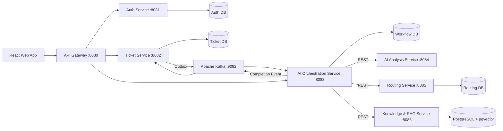

# ResolveIQ — AI-Assisted Customer-Support Resolution Platform

> **Resolve faster. Answer with evidence.**

ResolveIQ is a production-grade, event-driven customer support resolution platform built with **Java 21, Spring Boot, PostgreSQL/pgvector, Apache Kafka, and React**.

It assists support agents by performing structured classification, hybrid retrieval (combining full-text keyword search and vector embeddings) across approved knowledge articles and privacy-sanitized resolved cases, predicting SLA breach risk, generating citation-backed draft responses, and enforcing a **strict Human-in-the-Loop governance boundary** with **zero customer-visible auto-sends**.

---

## 1. High-Level Architecture



---

## 2. Module & Port Inventory

| Module | Directory | Port | Responsibility |
|---|---|---|---|
| **API Gateway** | `api-gateway` | `8080` | Edge routing, correlation ID injection, security header enforcement |
| **Auth Service** | `auth-service` | `8081` | Tenant isolation, JWT issuance, hashed refresh token rotation |
| **Ticket Service** | `ticket-service` | `8082` | Ticket lifecycle state machine, transactional outbox, message history |
| **AI Orchestration** | `ai-orchestration-service` | `8083` | Durable workflow state machine, async triage coordination |
| **AI Analysis** | `ai-analysis-service` | `8084` | Intent classification, sentiment scoring, PII entity redaction |
| **Routing Service** | `routing-service` | `8085` | Skill-based agent assignment, team matching, deterministic SLA clocks |
| **RAG Service** | `rag-service` | `8086` | Chunking, pgvector embeddings, hybrid RRF search, citation tracking |
| **Discovery Service** | `discovery-service` | `8761` | Spring Cloud Netflix Eureka registry for local dev |
| **Common Contracts** | `common-contracts` | — | Versioned event envelopes, DTOs, problem response primitives |
| **Frontend** | `frontend` | `3000` | React 18 + TypeScript + Vite + Tailwind agent workspace |

---

## 3. Key Differentiators & Guardrails

1. **Human-in-the-Loop:** No LLM-generated draft is ever sent directly to a customer. An authorized support agent must explicitly review, edit, or approve every external response.
2. **Hybrid Retrieval (RRF):** Blends lexical full-text search (`tsvector` + GIN) with dense semantic embeddings (`pgvector` cosine similarity).
3. **Explicit Abstention:** When knowledge evidence is insufficient or confidence falls below threshold, the copilot explicitly abstains rather than hallucinating.
4. **Sanitized Historic Cases:** Historic resolved tickets are sanitized for PII and approved by Knowledge Managers before being indexed into the retrieval corpus.
5. **Event-Driven Consistency:** Zero distributed transactions. Producers use the **Transactional Outbox Pattern**; consumers enforce **Idempotent Processing**.

---

## 4. Quick Start (Local Development)

### Prerequisites
- **Java 21**
- **Docker & Docker Compose**
- **Node.js 20+ & npm**

### 1. Start Infrastructure
```bash
docker compose up -d postgres kafka minio
```

### 2. Build Backend Services
```bash
./mvnw clean verify
```

### 3. Start Frontend Console
```bash
npm --prefix frontend install
npm --prefix frontend run dev
```
Open [http://localhost:3000](http://localhost:3000) to view the customer portal, agent workspace, knowledge console, and governance dashboard.

---

## 5. Testing & Verification

```bash
# Run backend test suite across all modules
./mvnw clean test

# Run frontend typecheck and production build
npm --prefix frontend run build

# Run secret scanning
./scripts/scan-secrets.sh
```

---

## 6. Blueprint & Specification

For complete architectural contracts, schema definitions, threat models, and phased implementation guidelines, consult [RESOLVEIQ_IMPLEMENTATION_BLUEPRINT.md](RESOLVEIQ_IMPLEMENTATION_BLUEPRINT.md).
