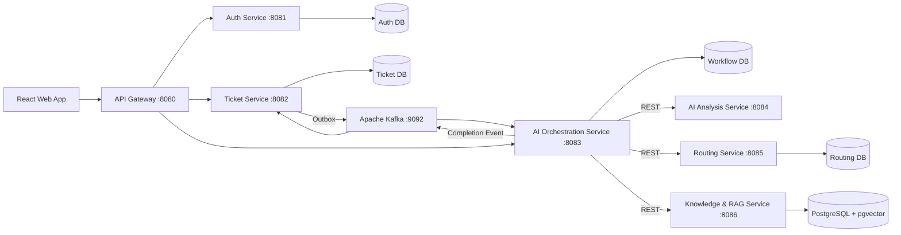

# ResolveIQ — AI-Assisted Customer-Support Resolution Platform

> **Resolve faster. Answer with evidence.**

ResolveIQ is a production-oriented, event-driven customer support portfolio platform built with **Java 21, Spring Boot, PostgreSQL/pgvector, Apache Kafka, and React**. Its core vertical slice is implemented; the remaining production acceptance gates are tracked honestly in `RESOLVEIQ_REMAINING_IMPLEMENTATION_PLAN.md`.

It assists support agents by performing structured classification, hybrid retrieval (combining full-text keyword search and vector embeddings) across approved knowledge articles and privacy-sanitized resolved cases, predicting SLA breach risk, generating citation-backed draft responses, and enforcing a **strict Human-in-the-Loop governance boundary** with **zero customer-visible auto-sends**.

---

## 1. High-Level Architecture



---

## 2. Module & Port Inventory

| Module | Directory | Port | Responsibility |
|---|---|---|---|
| **API Gateway** | `api-gateway` | `8080` | Edge routing, correlation ID injection, security header enforcement |
| **Auth Service** | `auth-service` | `8081` | Tenant isolation, JWT issuance, hashed refresh token rotation |
| **Ticket Service** | `ticket-service` | `8082` | Ticket lifecycle state machine, transactional outbox, message history |
| **AI Orchestration** | `ai-orchestration-service` | `8083` | Durable workflow state machine, async triage coordination |
| **AI Analysis** | `ai-analysis-service` | `8084` | Intent classification, sentiment scoring, PII entity redaction |
| **Routing Service** | `routing-service` | `8085` | Skill-based agent assignment, team matching, deterministic SLA clocks |
| **RAG Service** | `rag-service` | `8086` | Chunking, pgvector embeddings, hybrid RRF search, citation tracking |
| **Discovery Service** | `discovery-service` | `8761` | Spring Cloud Netflix Eureka registry for local dev |
| **Common Contracts** | `common-contracts` | — | Versioned event envelopes, DTOs, problem response primitives |
| **Common Security** | `common-security` | — | Service JWT validation, trusted tenant principal, route authorization |
| **Frontend** | `frontend` | `3000` | React 18 + TypeScript + Vite + Tailwind agent workspace |

---

## 3. Key Differentiators & Guardrails

1. **Human-in-the-Loop:** No LLM-generated draft is ever sent directly to a customer. An authorized support agent must explicitly review, edit, or approve every external response.
2. **Hybrid Retrieval (RRF):** Blends lexical full-text search (`tsvector` + GIN) with dense semantic embeddings (`pgvector` cosine similarity).
3. **Explicit Abstention:** When knowledge evidence is insufficient or confidence falls below threshold, the copilot explicitly abstains rather than hallucinating.
4. **Sanitized Historic Cases:** Historic resolved tickets are sanitized for PII and approved by Knowledge Managers before being indexed into the retrieval corpus.
5. **Event-Driven Consistency:** Zero distributed transactions. Producers use the **Transactional Outbox Pattern**; consumers enforce **Idempotent Processing**.

---

## 4. Quick Start (Local Development)

### Prerequisites
- **Java 21**
- **Docker & Docker Compose**
- **Node.js 20+ & npm**

### 1. Configure local environment
```bash
cp .env.example .env
```

### 2. Start the complete development application
```bash
docker compose --profile app up -d --build
```

The web application is available at [http://localhost:3000](http://localhost:3000). Only the frontend, API gateway, and development infrastructure publish host ports; owning backend services remain private inside the Compose network.

The `app` profile is wired for automatic local reload:

- React/TypeScript/CSS changes are applied by Vite HMR without restarting a container.
- Each Spring Boot container watches its module, `common-contracts`, `common-security`, resources, and relevant Maven POMs. It compiles in the background and automatically restarts only that service after a successful build.
- A failed Java build leaves the last successful service process running; saving a corrected source file triggers another build.
- `compose.yaml`, Dockerfile, frontend dependency-manifest, port, and container-environment changes still require `docker compose ... up -d --build` because they change the container definition rather than application source. Backend Maven POM changes are watched and rebuilt automatically.

The first build creates the development images and shared Maven dependency cache. Subsequent source edits do not require another Compose command. Production images remain available through the `prod` targets in both Dockerfiles.

### 3. Run quality gates directly
```bash
./mvnw clean verify
npm --prefix frontend ci
npm --prefix frontend run lint
npm --prefix frontend run test
npm --prefix frontend run build
./scripts/scan-secrets.sh
```

The default Docker profile uses deterministic local AI adapters so the demo is reproducible. The `production` Spring profile rejects deterministic providers, missing provider credentials, default JWT secrets, and insecure refresh cookies.

---

## 5. Testing & Verification

```bash
# Run backend test suite across all modules
./mvnw clean test

# Run frontend typecheck and production build
npm --prefix frontend run lint
npm --prefix frontend run test
npm --prefix frontend run build

# Run secret scanning
./scripts/scan-secrets.sh
```

---

## 6. Blueprint & Specification

For complete architectural contracts, schema definitions, threat models, and phased implementation guidelines, consult [RESOLVEIQ_IMPLEMENTATION_BLUEPRINT.md](RESOLVEIQ_IMPLEMENTATION_BLUEPRINT.md).
