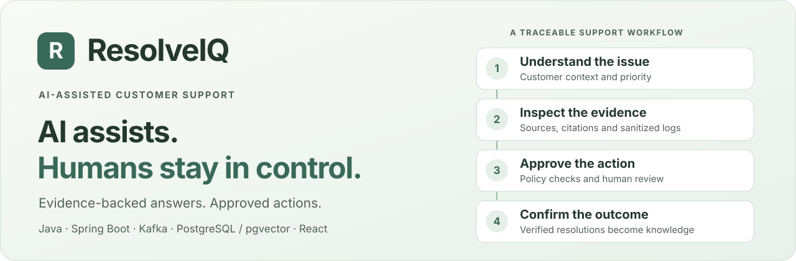
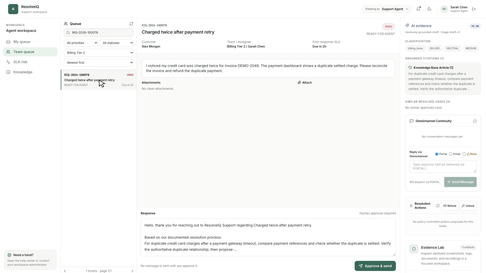
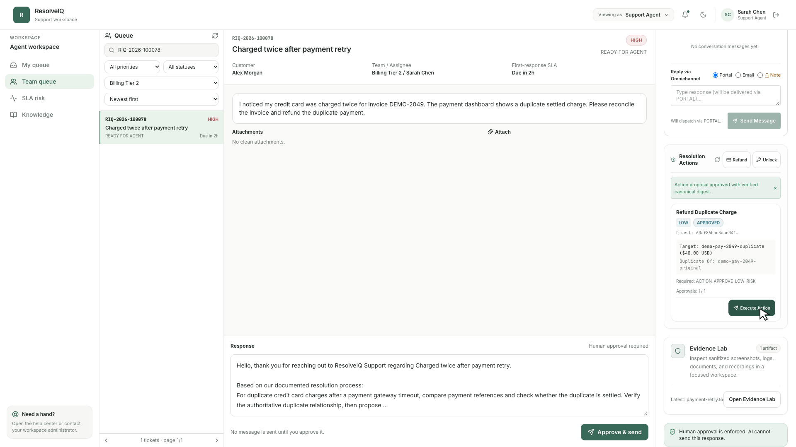
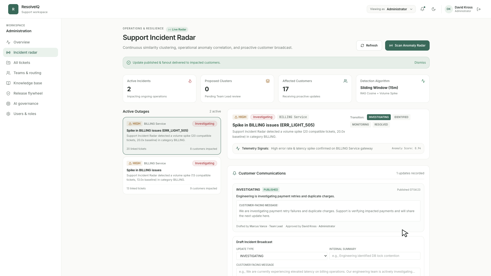
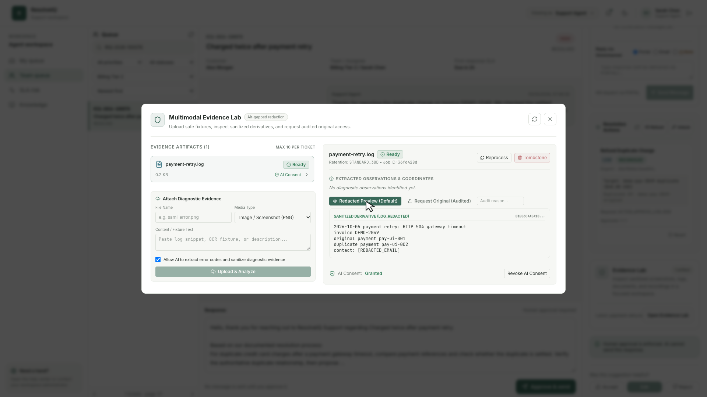
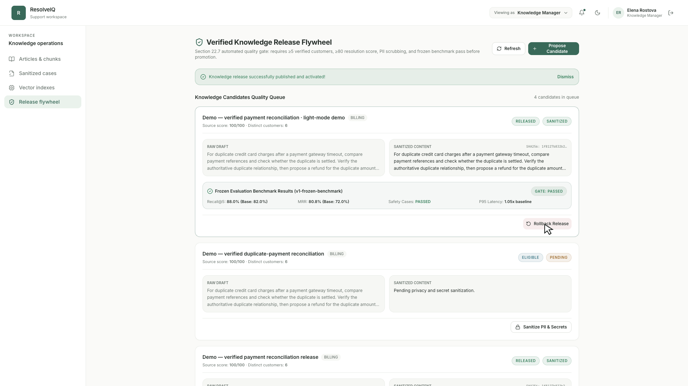
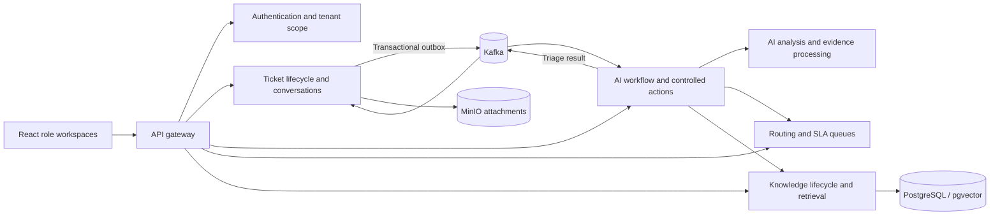

# ResolveIQ

**An AI-assisted customer-support platform that turns a reported problem into an evidence-backed answer, a human-approved action, and a confirmed outcome.**

A customer says, “I was charged twice.” ResolveIQ brings the ticket, relevant guidance, supporting evidence and refund controls into one workspace. AI helps investigate and draft; an authorized person decides what to send or execute. Confirmed resolutions can become reviewed knowledge for the next case.

Built as an end-to-end engineering portfolio project with **Java 21, Spring Boot, Apache Kafka, PostgreSQL/pgvector, and React/TypeScript**. Explore it through recorded demos and screenshots, or run the complete application locally with Docker.

**[Watch the demo](#watch-the-product) · [Explore screenshots](#product-in-action) · [See results](#results-and-evidence) · [Explore the architecture](#engineering-behind-the-workflow) · [Run locally](#run-it-locally)**

| 6 role-specific workspaces | 8 Java services + 2 shared libraries | Human approval before customer sends |
| :---: | :---: | :---: |
| Customer → agent → knowledge → audit | Full-stack, event-driven implementation | AI suggestions stay behind a review boundary |

## Why this project matters

Support teams need more than a plausible answer. They need to know **where it came from, whether an action is safe, whether the customer’s problem was actually solved, and what can be reused next time**.

| Support problem | What ResolveIQ implements | Why it helps |
| --- | --- | --- |
| Agents repeatedly search for context | Classification, routing, priority queues and citation-backed drafts | Puts investigation and response in one place. |
| A suggested refund can be wrong or repeated | Policy checks, approval, input-integrity checks, idempotent execution and reconciliation | Makes actions reviewable and protects against repeated effects. |
| Similar tickets hide a shared incident | Incident clustering, review and approved customer updates | Connects individual complaints to a coordinated response. |
| Customer evidence can expose sensitive data | Consent, sanitized previews and audited original access | Supports useful investigation with privacy controls. |
| A closed ticket does not prove success | Customer confirmation and a gated knowledge-release workflow | Promotes reviewed resolutions instead of trusting every closure. |

## Watch the product

### Full walkthrough · 4 minutes 30 seconds

Follow a duplicate-charge case across customer, support agent, team lead, administrator, knowledge manager and auditor workspaces.

https://github.com/user-attachments/assets/f01804c3-f185-4e0d-8a52-a2be47bb1095

Playback link: [▶ Watch the full product demo](https://github.com/user-attachments/assets/f01804c3-f185-4e0d-8a52-a2be47bb1095)

| Time | What to look for |
| --- | --- |
| **00:08** | Customer reports the duplicate charge. |
| **00:30** | Agent inspects triage, routing and grounded citations. |
| **01:22** | Consented evidence appears in a redacted preview. |
| **01:46** | A $40 simulated refund moves through proposal, approval and execution. |
| **02:16** | Agent reviews and sends the customer response. |
| **02:42** | A shared incident moves into reviewed customer communication. |
| **03:10** | Customer confirms the resolution. |
| **03:30** | A prepared resolution cohort becomes sanitized, evaluated and released knowledge. |
| **04:00** | Administrator governance and auditor evidence. |

<details>
<summary><strong>Short on time? Watch the 20-second product intro</strong></summary>

An illustrated overview of the evidence and human-approval workflow. The full walkthrough above shows the actual application.

https://github.com/user-attachments/assets/ee8e1ab5-e552-437f-9a97-4a5ff6711c16

Playback link: [▶ Watch the product intro](https://github.com/user-attachments/assets/ee8e1ab5-e552-437f-9a97-4a5ff6711c16)

</details>

> **Demo scope:** a local portfolio environment with fictional customers, simulated payments and deterministic AI. The videos and screenshots show implemented workflows; their scores and fixture counts are not production business results. There is no public live deployment at this stage.

## Product in action

### The agent’s workspace

The queue, customer context, approved article citation and response editor are visible together. **The AI draft is not sent until a person approves it.**

[](docs/assets/readme/support-workspace.png)

### Four workflows beyond answering a ticket

These are actual light-mode application captures. Click any image to inspect it at full size.

<table>
  <tr>
    <td width="50%" valign="top">
      <strong>Controlled resolution actions</strong><br />
      A $40 simulated refund is approved; execution remains a separate step.<br /><br />
      <a href="docs/assets/readme/refund-approval.png"></a>
    </td>
    <td width="50%" valign="top">
      <strong>Incident Radar</strong><br />
      A team lead drafts the update; an administrator approves its publication.<br /><br />
      <a href="docs/assets/readme/incident-radar.png"></a>
    </td>
  </tr>
  <tr>
    <td width="50%" valign="top">
      <strong>Evidence Lab</strong><br />
      Consent and a redacted preview protect sensitive customer information.<br /><br />
      <a href="docs/assets/readme/evidence-lab.png"></a>
    </td>
    <td width="50%" valign="top">
      <strong>Verified knowledge release</strong><br />
      Confirmed outcomes feed sanitization, evaluation, release and rollback controls.<br /><br />
      <a href="docs/assets/readme/knowledge-release.png"></a>
    </td>
  </tr>
</table>

The platform also keeps portal/email conversation history and internal notes in a canonical ticket timeline, with identity verification and human handoff controls.

## Results and evidence

The achievement is a working support lifecycle with explicit safety boundaries: **ticket → evidence → approved action → customer confirmation → reviewed knowledge**. The recorded demo includes a reconciled $40 simulated refund, an approved incident update and a released knowledge candidate from six fictional confirmed customers.

### Measured engineering trade-offs

The [recorded local retrieval benchmark](evaluation/reports/live_retrieval_benchmark.json) compares strategies over **100 synthetic queries and 20 knowledge articles**, using a real Spring Boot API and PostgreSQL/pgvector path with local sentence-transformer embeddings.

| Measure | Keyword search | Hybrid keyword + vector search | Interpretation |
| --- | ---: | ---: | --- |
| Mean reciprocal rank (MRR) | 0.9037 | **0.9725** | Relevant answers appeared closer to the top; higher is better. |
| Server-reported p95 latency | **2 ms** | 11 ms | Better ranking came with more retrieval work. |

That run recorded a **7.62% relative MRR improvement**, with unchanged top-five hit rate. These are September 22, 2026 local measurements on a small synthetic corpus, not production accuracy or throughput claims. [Benchmark runner](evaluation/scripts/run_live_retrieval_benchmark.py)

The [action fault-simulation report](evaluation/reports/live_action_benchmark.json) records:

| Scenario | Recorded outcome |
| --- | --- |
| Successful refund/account-unlock executions | **100 / 100 reconciled** |
| Duplicate retries | **100 / 100 without a repeated effect** |
| Invalid actions | **100 / 100 denied before approval** |

These scenarios use simulated payment/identity adapters and mocked persistence. They demonstrate boundary behavior, not live payment performance or real-world incident rates. [Scenario implementation](ai-orchestration-service/src/test/java/com/resolveiq/orchestration/application/action/ResolutionActionBenchmarkTest.java)

## Engineering behind the workflow

The frontend is organized around six personas. Backend services own their business data and communicate through authenticated APIs and Kafka events.


```mermaid
flowchart LR
    UI[React role workspaces] --> GW[API gateway]
    GW --> AUTH[Authentication and tenant scope]
    GW --> T[Ticket lifecycle and conversations]
    GW --> O[AI workflow and controlled actions]
    GW --> R[Routing and SLA queues]
    GW --> K[Knowledge lifecycle and retrieval]
    O --> A[AI analysis and evidence processing]
    O --> R
    O --> K
    T -->|Transactional outbox| E[(Kafka)]
    E --> O
    O -->|Triage result| E
    E --> T
    K --> V[(PostgreSQL / pgvector)]
    T --> S[(MinIO attachments)]
```

The diagram highlights the main workflow; discovery, other service-owned PostgreSQL schemas and observability are omitted for readability. [Detailed architecture](docs/part1/ARCHITECTURE_AND_DEMO_EVIDENCE.md)

| Engineering decision | Implementation and purpose |
| --- | --- |
| **Reliable asynchronous processing** | Ticket changes and outbox events persist atomically; idempotent consumers handle repeated delivery. Durable orchestration records workflow state and supports replay. |
| **Retrieval with provenance** | Full-text search and vector similarity combine through reciprocal rank fusion. Retrieval filters authorized, published, active knowledge and returns citations. |
| **Actions with integrity** | Version checks, canonical digests, policy decisions and approval counts bind execution to reviewed inputs. High-risk actions add step-up authentication and proposer exclusion. |
| **Tenant and role boundaries** | JWT validation at gateway and owning services; customer ownership checks, scoped staff access and read-only auditors. |
| **Knowledge lifecycle** | Draft/review/publication, indexing, supersession and rollback align retrieval with approved content. |
| **Operational visibility** | Ticket/workflow audit, outbox health, AI governance traces and service-owned OpenAPI documents make state inspectable. |

<details>
<summary><strong>Technology and service ownership</strong></summary>

| Layer | Technologies |
| --- | --- |
| Frontend | React 18, TypeScript, Vite, Tailwind CSS, TanStack Query |
| Backend | Java 21, Spring Boot 3.3, Spring Security, Maven |
| Data and retrieval | PostgreSQL 16, pgvector, full-text search, hybrid RRF |
| Events and storage | Apache Kafka, transactional outbox, MinIO |
| Testing | JUnit, Mockito/AssertJ, Testcontainers, Vitest, Playwright |
| Runtime/deployment definitions | Docker Compose, Kubernetes/Kustomize, OpenTelemetry, Prometheus, Grafana |

| Directory | Owns |
| --- | --- |
| [`api-gateway`](api-gateway) | Browser-facing routing and edge security |
| [`auth-service`](auth-service) | Authentication, refresh sessions and tenant directory |
| [`ticket-service`](ticket-service) | Tickets, conversations, attachments, incidents and outcomes |
| [`ai-orchestration-service`](ai-orchestration-service) | Durable triage and controlled actions |
| [`ai-analysis-service`](ai-analysis-service) | Classification, guardrails and evidence processing |
| [`routing-service`](routing-service) | Teams, assignments, rules and SLA policies |
| [`rag-service`](rag-service) | Knowledge versions, hybrid search and release evaluation |
| [`discovery-service`](discovery-service) | Local service discovery |
| [`common-contracts`](common-contracts), [`common-security`](common-security) | Shared event/API contracts and security primitives |

</details>

## Run it locally

**For a quick review, the videos and screenshots need no setup.** For hands-on exploration, use Docker Compose, Python 3, `curl` and `jq`. Host-side development/test commands also need Java 21 and Node.js 20/npm.

```bash
git clone https://github.com/Lalithsha/ResolveIQ.git
cd ResolveIQ
cp .env.example .env

# Start the application and wait for healthy services.
docker compose --profile app up -d --build --wait --wait-timeout 420

# Create fictional users, routing fixtures and lifecycle-indexed knowledge.
./scripts/seed-data.sh
```

Open **[localhost:3000](http://localhost:3000)**. The first build can take several minutes. Start with the **Customer** and **Support Agent** accounts in the [demo account guide](UI_END_TO_END_TESTING_GUIDE.md#demo-accounts), then explore the remaining roles. Provider credentials are not required for the deterministic demo.

The base seed establishes users, tickets and knowledge. Extra incident, action, evidence and outcome scenarios are prepared in the [Part 2 walkthrough](UI_END_TO_END_TESTING_GUIDE.md#12-part-2-test-data-preparation). It does not recreate every recorded screenshot automatically.

The development profile supports frontend hot reload and backend rebuild/restart. If ports are occupied, use the [conflict-free startup guide](docs/part1/ARCHITECTURE_AND_DEMO_EVIDENCE.md#6-local-proof-run).

## Verification and current scope

The repository includes unit/service tests, Kafka and pgvector integration tests, frontend checks and six-role browser journeys. [CI workflow](.github/workflows/ci.yml) · [Manual acceptance guide](UI_END_TO_END_TESTING_GUIDE.md) · [Part 2 gate harness](verification/part2)

```bash
./mvnw clean verify
npm --prefix frontend ci
npm --prefix frontend run lint
npm --prefix frontend run test
npm --prefix frontend run build

# Requires the healthy, seeded local stack.
npm --prefix frontend run test:e2e
```

The demo establishes functional local workflows. It does not establish production adoption, customer time savings, real payment settlement or full deployment acceptance. The [historical Part 2 certificate](verification/part2/final_p2_certificate.json) is explicitly **NOT_ACCEPTED** pending the broader real-media, retrieval, coverage, load, restore and recovery gates. Existing CI lint and JWT-fixture secret-scan findings are tracked in the [demo README PR](https://github.com/Lalithsha/ResolveIQ/pull/2); an all-green CI claim is not made here.

## Explore further

| If you want to understand… | Start here |
| --- | --- |
| Architectural contracts and boundaries | [Implementation blueprint](RESOLVEIQ_IMPLEMENTATION_BLUEPRINT.md) |
| The core support platform | [Part 1 implementation record](RESOLVEIQ_PART1_IMPLEMENTATION_PLAN.md) |
| Incidents, actions, evidence and verified knowledge | [Part 2 plan and acceptance criteria](RESOLVEIQ_PART2_IMPLEMENTATION_PLAN.md) |
| Code-backed workflows and the interview demo | [Architecture and demonstration evidence](docs/part1/ARCHITECTURE_AND_DEMO_EVIDENCE.md) |
| API contracts, after starting locally | Gateway `/openapi/auth`, `/openapi/ticket`, `/openapi/orchestration`, `/openapi/analysis`, `/openapi/routing`, `/openapi/rag` |
| Deployment definitions | [Kubernetes base](infra/k8s/base) — code supplied, not a hosted environment |

Licensed under [Apache 2.0](LICENSE). [Screenshot provenance](docs/assets/readme/README.md)
