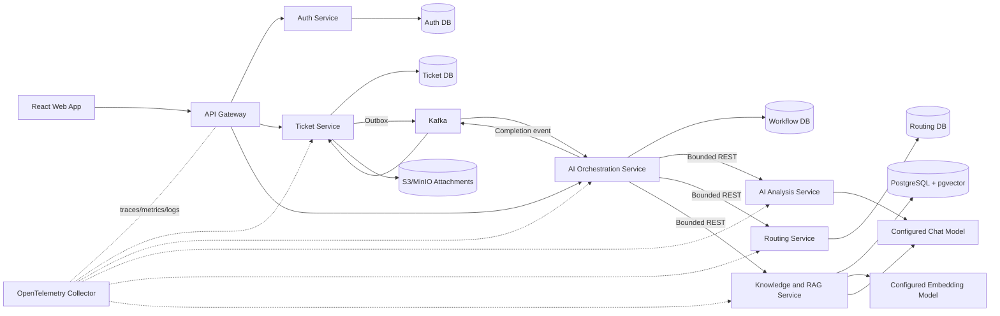
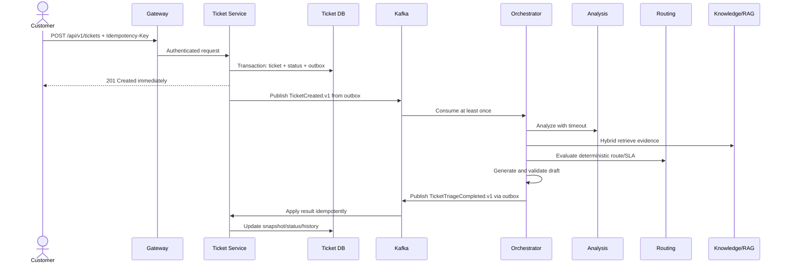

# ResolveIQ — Production-Grade Implementation Blueprint

> **Document status:** Implementation-ready specification  
> **Repository directory:** `resolveiq`  
> **Target audience:** A software engineer or coding agent implementing the product end to end  
> **Primary stack:** Java 21, Spring Boot, Spring AI, PostgreSQL/pgvector, Kafka, React, TypeScript  
> **Execution rule:** Implement phase by phase. Do not skip a phase gate. Do not commit, create a remote, or push until the repository-owner approval gate in Phase 0 is satisfied.

---

## 1. Purpose of this document

This is the single source of truth for building **ResolveIQ**, an AI-assisted customer-support resolution platform. The repository already has a distributed support-system baseline. The work described here hardens that baseline and builds the differentiated product on top of it.

An implementation agent must be able to use this document without inventing product behavior, architecture, colors, API conventions, security decisions, test strategy, or deployment expectations. When code and this document conflict, stop and record the conflict before changing the intended behavior.

This is a production-shaped portfolio project, not a claim that the system can serve a large enterprise without deployment-specific validation. Production-grade here means that failure modes, security, observability, data consistency, testing, delivery, and operator workflows are designed and demonstrated—not merely mentioned in a README.

---

## 2. Product definition

### 2.1 One-line description

**ResolveIQ helps customer-support agents triage and resolve tickets faster by finding similar resolved cases and approved knowledge, generating citation-backed draft responses, predicting SLA risk, and keeping a human in control of every customer-facing action.**

### 2.2 The real problem

Support teams lose time because:

- incoming tickets must be manually categorized, prioritized, and routed;
- the same issue is solved repeatedly by different agents;
- useful answers are scattered across knowledge articles and old tickets;
- urgent or high-risk tickets can sit unnoticed;
- generic LLM answers can hallucinate policy or expose sensitive data;
- managers cannot measure whether AI suggestions are accurate, safe, or useful.

ResolveIQ converts support history and approved documentation into a governed retrieval system. It assists agents; it does not silently make irreversible decisions.

### 2.3 Differentiators

ResolveIQ is not “chat with a PDF.” Its differentiators are:

1. **Support-specific hybrid retrieval** across approved knowledge and sanitized resolved cases.
2. **Citation-backed response drafting** with an explicit abstain path when evidence is weak.
3. **Duplicate and similar-ticket detection** using embeddings plus metadata.
4. **Deterministic SLA and routing rules** augmented by AI classification, not controlled by it.
5. **Human-in-the-loop governance** for every external response or state-changing AI recommendation.
6. **Measurable AI quality** through offline datasets, retrieval metrics, groundedness checks, and agent feedback.
7. **Event-driven workflow reliability** using outbox, idempotency, retries, dead-letter handling, and trace propagation.
8. **Operational transparency** showing latency, model/provider, prompt version, evidence, confidence, cost estimate, and failure reason.

### 2.4 Product boundaries

#### In scope

- Customer ticket creation and conversation.
- Agent queue and collaborative ticket workspace.
- Role-based access control.
- AI classification: intent, category, sentiment, urgency, language, entities, and confidence.
- Deterministic routing and SLA-risk calculation.
- Knowledge article lifecycle and versioning.
- Resolved-case ingestion after privacy sanitization and approval.
- Hybrid semantic/keyword retrieval with metadata filters.
- Suggested response with citations and confidence.
- Similar-ticket and duplicate-ticket detection.
- Agent accept/edit/reject feedback.
- Governance, audit, evaluation, observability, and cost dashboards.
- Local Docker Compose environment and one reproducible staging deployment.
- Controlled, read-only tool calling against synthetic product/order data as a later showcase capability.

#### Explicitly out of scope for the first public release

- Sending refunds, cancelling orders, or changing external business systems without human approval.
- Training or fine-tuning a foundation model.
- Replacing a real help-desk product in production.
- Omnichannel email/WhatsApp/voice ingestion.
- Active-active multi-region deployment.
- A separate vector database when pgvector meets measured requirements.
- Kubernetes before the Compose-based system, tests, and observability are stable.
- Fully autonomous agents.

---

## 3. Users, roles, and permission model

### 3.1 Personas

| Persona | Primary goal | Key pain point |
|---|---|---|
| Customer | Report a problem and receive updates | Repeating context and waiting without visibility |
| Support Agent | Resolve assigned tickets accurately and quickly | Searching multiple systems and rewriting known answers |
| Team Lead | Balance work and protect SLAs | Limited visibility into queues, quality, and escalations |
| Knowledge Manager | Maintain approved support content | Outdated, duplicated, or uncited knowledge |
| Administrator | Configure the platform and manage access | Unsafe defaults and weak auditability |
| Auditor/Reviewer | Inspect AI decisions and evidence | Cannot reproduce why a suggestion was produced |

### 3.2 Roles

- `CUSTOMER`
- `AGENT`
- `TEAM_LEAD`
- `KNOWLEDGE_MANAGER`
- `ADMIN`
- `AUDITOR`

### 3.3 Authorization principles

- Deny by default.
- A customer can access only tickets belonging to their tenant and user ID.
- An agent can access tickets assigned to their team; personally sensitive fields may require assignment.
- A team lead can view and reassign tickets within managed teams.
- A knowledge manager can draft, review, publish, archive, and reindex knowledge content.
- An administrator manages users, teams, routing rules, providers, and system settings but cannot silently modify audit history.
- An auditor has read-only access to AI traces, approvals, evaluation results, and audit records.
- Tenant identity comes from a verified token, never a request body or client-provided trusted header.
- Authorization is checked inside the owning service even when the gateway has already authenticated the request.

### 3.4 Permission matrix

| Capability | Customer | Agent | Team Lead | Knowledge Manager | Admin | Auditor |
|---|---:|---:|---:|---:|---:|---:|
| Create own ticket | Yes | No | No | No | Optional | No |
| View own tickets | Yes | No | No | No | Yes | No |
| View team queue | No | Yes | Yes | No | Yes | Read-only |
| Reply to customer | Own ticket only | Assigned/team | Yes | No | Yes | No |
| Accept/edit AI draft | No | Yes | Yes | No | Yes | Read-only |
| Reassign ticket | No | Limited | Yes | No | Yes | Read-only |
| Publish knowledge | No | Suggest only | Suggest only | Yes | Yes | Read-only |
| Configure routing/SLA | No | No | Limited | No | Yes | Read-only |
| View governance/audit | Own history only | Own actions | Team | Knowledge actions | Yes | Yes |

---

## 4. Success criteria and measurable targets

### 4.1 Product KPIs for the demo dataset

- At least 50 synthetic tickets covering billing, authentication, delivery, account, and technical-support cases.
- At least 30 approved knowledge articles with versions and metadata.
- At least 30 sanitized resolved cases eligible for retrieval.
- At least 100 labeled query/evidence pairs for retrieval evaluation.
- At least 80% Recall@5 on the frozen retrieval evaluation set.
- At least 70% Mean Reciprocal Rank on the frozen retrieval evaluation set.
- At least 90% of generated factual claims supported by returned citations on the curated evaluation set.
- Zero customer-visible auto-sends from an AI workflow.
- Every AI suggestion displays evidence, model/provider, prompt version, timestamp, confidence, and status.
- Agent feedback is captured for accepted, edited, rejected, and regenerated suggestions.

### 4.2 Initial service-level objectives

These are engineering targets, not contractual SLAs.

| Operation | Target |
|---|---|
| Create ticket API | p95 ≤ 500 ms excluding attachment upload |
| Read/list APIs | p95 ≤ 300 ms at portfolio load |
| Hybrid retrieval | p95 ≤ 800 ms for 100,000 chunks locally/staging |
| Ticket creation acknowledgement | Returned before AI processing starts |
| AI triage workflow | p95 ≤ 20 seconds; hard timeout 60 seconds |
| Dashboard freshness | ≤ 60 seconds |
| Event processing success | ≥ 99% without manual replay |
| Duplicate event safety | No duplicate business-state transition |
| Staging availability target | 99.5% during demo period |

### 4.3 Portfolio proof points

The finished project must visibly prove:

- Java/Spring backend design;
- distributed event processing and consistency decisions;
- relational and vector data modeling;
- production RAG and evaluation;
- security and AI governance;
- frontend UX and accessibility;
- testing, CI/CD, observability, and deployment;
- the ability to explain trade-offs appropriate to an engineer with roughly 2–3 years of experience.

---

## 5. Architecture principles

### 5.1 Core principles

1. **Business rules remain deterministic.** The LLM may classify or recommend; it does not define ticket-state transitions, routing eligibility, authorization, or SLA clocks.
2. **Human approval is a boundary.** No generated response is sent externally until an authorized user explicitly confirms it.
3. **AI output is untrusted input.** Validate structured output, length, allowed enums, citations, and policy constraints.
4. **Use asynchronous processing for slow work.** Ticket creation must not wait for model calls or vector retrieval.
5. **Use synchronous calls for immediate capability composition.** The orchestrator can call analysis, routing, and retrieval with bounded timeouts when executing one workflow.
6. **No distributed transactions.** Use local transactions, outbox events, idempotent consumers, and explicit eventual consistency.
7. **One owner per datum.** Services do not read or write another service’s tables.
8. **Contracts are versioned.** REST and event changes must be backward-compatible or receive a new version.
9. **Observability is part of the feature.** Every workflow can be traced from request to event to model call to final suggestion.
10. **Prefer the simplest proven component.** Do not add Redis, Kubernetes, a service mesh, or another database without a measured need.
11. **Build for failure.** Timeouts, retries, circuit breakers, dead-letter paths, replay, and degraded behavior must be testable.
12. **Protect privacy at ingestion.** Resolved tickets are sanitized before becoming retrieval content.

### 5.2 Design and code principles

- Apply SOLID at class/module boundaries, not as an excuse for excessive interfaces.
- Use domain-driven module names: `ticket`, `knowledge`, `routing`, `workflow`, `identity`, `governance`.
- Use hexagonal/ports-and-adapters structure for external dependencies such as LLMs, embeddings, object storage, and event brokers.
- Controllers translate HTTP; they do not contain business logic.
- Application services orchestrate use cases.
- Domain objects protect invariants and state transitions.
- Repositories abstract owned persistence only.
- Provider-specific code stays behind interfaces.
- Avoid generic `Util`, `Helper`, and `Manager` dumping grounds.
- Prefer immutable records for commands, events, and API DTOs.
- Use constructor injection.
- Never return persistence entities directly from controllers.
- Time is supplied through `Clock` where behavior is time-dependent.
- IDs are opaque UUIDs; human-visible tickets use a separate number such as `RIQ-2026-000123`.

### 5.3 Distributed system decision appropriate to this project

The baseline already contains service boundaries and Kafka. Keep them because AI workflows are slow, failure-prone, and independently scalable. Do not create additional microservices for attachments, notifications, evaluation, or audit in the first release. Implement those capabilities inside their owning service until load, team ownership, or deployment isolation justifies extraction.

For local development, run one PostgreSQL container with separate databases/schemas per service. The logical ownership boundary must still be enforced. For staging, separate credentials per service even if they share a PostgreSQL server.

---

## 6. High-level architecture



### 6.1 Runtime components

| Component | Responsibility | Public? | Data owner | Scale trigger |
|---|---|---:|---|---|
| Web application | Customer, agent, admin, governance UX | Yes | Browser state only | CDN/static scaling |
| API Gateway | TLS termination integration, authentication enforcement, routing, rate limiting, correlation | Yes | No business data | Request throughput |
| Auth Service | Users, credentials, roles, sessions, refresh-token rotation | Via gateway | Auth DB | Login/session load |
| Ticket Service | Ticket lifecycle, messages, assignments, attachments metadata, agent feedback | Via gateway | Ticket DB | API and message volume |
| AI Orchestration Service | Durable workflow state, steps, approvals, tool coordination | Internal/admin via gateway | Workflow DB | Workflow backlog |
| AI Analysis Service | Structured ticket classification and PII/entity analysis | Internal | Analysis results if persisted | Model concurrency/rate limit |
| Routing Service | Teams, skills, routing rules, deterministic route and SLA policy | Internal/admin via gateway | Routing DB | Rule evaluation volume |
| Knowledge/RAG Service | Articles, versions, chunks, embeddings, retrieval, citations, resolved-case corpus | Internal/admin via gateway | Knowledge DB | Retrieval/indexing load |
| Discovery Service | Local/Compose service discovery only | Internal | None | Not used in Kubernetes |
| Kafka | Durable asynchronous events | Internal | Event log | Partition lag/throughput |
| PostgreSQL/pgvector | Transactional data and vector search | Internal | Per-service logical DB | CPU, IOPS, dataset size |
| MinIO/S3 | Ticket attachment objects | Internal | Ticket service metadata | Object volume |
| OpenTelemetry stack | Traces, metrics, logs | Admin only | Telemetry store | Retention/query load |

### 6.2 Communication rules

- Browser traffic goes only through the gateway.
- Internal services are not exposed on public network interfaces.
- Kafka is used for business events and long-running workflow triggers/completions.
- REST is used for bounded, request/response capability calls inside a workflow.
- Every request/event carries `tenantId`, `correlationId`, and a stable actor/service identity where applicable.
- Internal REST calls use service credentials or mTLS in staging; gateway identity headers alone are insufficient as a production trust mechanism.
- Set explicit connect, response, and total timeouts for every internal and model call.

---

## 7. Core workflows and state machines

### 7.1 Ticket lifecycle

Canonical states:

```text
NEW
  -> TRIAGE_PENDING
  -> TRIAGE_IN_PROGRESS
  -> READY_FOR_AGENT | TRIAGE_FAILED
READY_FOR_AGENT
  -> ASSIGNED
  -> IN_PROGRESS
  -> WAITING_FOR_CUSTOMER | WAITING_FOR_INTERNAL
  -> RESOLVED
RESOLVED
  -> CLOSED
CLOSED
  -> REOPENED -> IN_PROGRESS
```

Rules:

- Only the Ticket Service changes ticket status.
- Every transition is validated by a state machine and recorded in `ticket_status_history`.
- AI failure never prevents ticket creation or manual assignment.
- `TRIAGE_FAILED` remains visible and manually actionable.
- Closing requires a resolution summary and resolution code.
- Reopening preserves the previous resolution history.
- Use optimistic locking on the ticket aggregate to prevent lost updates.

### 7.2 AI workflow lifecycle

```text
PENDING -> RUNNING -> COMPLETED
                    -> PARTIALLY_COMPLETED
                    -> FAILED_RETRYABLE -> RETRY_SCHEDULED -> RUNNING
                    -> FAILED_FINAL
                    -> CANCELLED
```

Required durable steps:

1. Receive and deduplicate `TicketCreated.v1`.
2. Snapshot safe ticket input.
3. Run structured analysis.
4. Calculate deterministic SLA risk.
5. Retrieve relevant knowledge and similar resolved cases.
6. Decide routing through rule evaluation.
7. Generate an optional grounded draft.
8. Validate structured output and citations.
9. Persist workflow result and diagnostics.
10. Publish `TicketTriageCompleted.v1` or `TicketTriageFailed.v1` via outbox.
11. Ticket Service applies result idempotently.

### 7.3 Suggestion lifecycle

```text
GENERATING -> READY -> ACCEPTED
                    -> EDITED_AND_ACCEPTED
                    -> REJECTED
                    -> EXPIRED
                    -> INVALIDATED
```

- A new customer message invalidates a stale unsent suggestion.
- Sending requires the expected suggestion version and ticket version.
- Accepted text is persisted separately from the original generated text.
- Feedback captures the reason for rejection or major edit.

### 7.4 Knowledge lifecycle

```text
DRAFT -> IN_REVIEW -> PUBLISHED -> ARCHIVED
                   -> CHANGES_REQUESTED -> DRAFT
```

- Only a published version is eligible for customer-facing retrieval.
- Publishing creates an immutable content version and an embedding job.
- A new version does not overwrite the old one.
- Retrieval results include version and validity timestamps.
- When a version becomes inactive, its chunks are excluded immediately by metadata even before cleanup.

### 7.5 Ticket creation sequence



---

## 8. Event-driven design

### 8.1 Event envelope

Every event uses this envelope:

```json
{
  "eventId": "uuid",
  "eventType": "resolveiq.ticket.created",
  "eventVersion": 1,
  "occurredAt": "2026-08-29T00:00:00Z",
  "producer": "ticket-service",
  "tenantId": "uuid",
  "aggregateType": "ticket",
  "aggregateId": "uuid",
  "correlationId": "uuid",
  "causationId": "uuid-or-null",
  "traceparent": "w3c-trace-context",
  "payload": {}
}
```

### 8.2 Initial event catalog

| Event | Producer | Consumer | Partition key |
|---|---|---|---|
| `TicketCreated.v1` | Ticket | Orchestrator | `ticketId` |
| `TicketMessageAdded.v1` | Ticket | Orchestrator | `ticketId` |
| `TicketTriageCompleted.v1` | Orchestrator | Ticket | `ticketId` |
| `TicketTriageFailed.v1` | Orchestrator | Ticket | `ticketId` |
| `TicketAssigned.v1` | Ticket | Analytics/Orchestrator | `ticketId` |
| `TicketResolved.v1` | Ticket | Knowledge | `ticketId` |
| `ResolvedCaseApproved.v1` | Ticket | Knowledge | `ticketId` |
| `KnowledgeVersionPublished.v1` | Knowledge | Knowledge indexer | `documentId` |
| `KnowledgeIndexingCompleted.v1` | Knowledge | Admin UI projection | `documentId` |
| `AgentFeedbackRecorded.v1` | Ticket | Evaluation projection | `suggestionId` |

### 8.3 Delivery semantics

- Kafka provides at-least-once delivery; business handlers must be idempotent.
- Each consumer stores `eventId` in a `processed_events` table in the same transaction as its state change.
- Ordering is guaranteed only per partition key. All ticket events use `ticketId` as key.
- Producer outbox rows use `PENDING`, `PUBLISHED`, `RETRY`, and `DEAD` states.
- Outbox publishing uses bounded retry with exponential backoff and jitter.
- Consumer failure moves to retry topics, then a dead-letter topic after the configured maximum.
- An admin replay endpoint accepts only a DLQ record ID, requires `ADMIN`, records an audit entry, and uses the original event ID.
- Do not retry validation, authorization, unsupported-model-output, or permanent schema errors.
- Retry network timeouts, 429 responses respecting `Retry-After`, and transient 5xx errors.

### 8.4 Contract rules

- JSON property names never change inside a published event version.
- New optional fields are allowed with defaults.
- Breaking changes create a new event version and a migration window.
- Event payloads contain IDs and necessary snapshots, not ORM entities.
- Never put access tokens, passwords, complete attachments, or raw secrets in events.
- Test producers and consumers with contract fixtures in CI.

---

## 9. Data architecture

### 9.1 General data rules

- PostgreSQL is the system of record.
- Use Flyway for every schema change; never rely on `ddl-auto=update`.
- Store timestamps as UTC `timestamptz` and expose ISO-8601.
- Add `created_at`, `updated_at`, `created_by`, and optimistic `version` where relevant.
- Include `tenant_id` on business records even while the first deployment runs one tenant.
- Use database constraints for uniqueness and invariant support.
- Use soft deletion only where recovery/audit requirements justify it. Tickets are never hard-deleted through normal APIs.
- PII retention and deletion workflows operate by policy, not ad hoc SQL.

### 9.2 Auth Service tables

- `tenants`
- `users`
- `roles`
- `user_roles`
- `refresh_tokens` storing only hashes
- `login_attempts`
- `password_reset_tokens` storing only hashes
- `security_audit_events`

Key indexes:

- unique `(tenant_id, normalized_email)`;
- `(user_id, revoked_at, expires_at)` on refresh tokens;
- `(tenant_id, occurred_at desc)` on security audit.

### 9.3 Ticket Service tables

- `tickets`
- `ticket_messages`
- `ticket_status_history`
- `ticket_assignments`
- `ticket_attachments`
- `ticket_ai_snapshots`
- `ai_suggestions`
- `suggestion_feedback`
- `resolution_records`
- `idempotency_keys`
- `outbox_events`
- `processed_events`

Important ticket fields:

- internal `id` UUID;
- public `ticket_number`;
- `tenant_id`, `customer_id`, `team_id`, `assigned_agent_id`;
- `subject`, `description`, normalized language;
- `status`, `priority`, `category`, `channel`;
- `sla_policy_id`, `first_response_due_at`, `resolution_due_at`;
- `ai_triage_status`, `latest_suggestion_id`;
- `created_at`, `updated_at`, `resolved_at`, `closed_at`, `version`.

### 9.4 Orchestration tables

- `workflow_instances`
- `workflow_steps`
- `workflow_attempts`
- `tool_invocations`
- `human_approvals`
- `workflow_audit_events`
- `outbox_events`
- `processed_events`

Persist inputs and outputs after redaction. Large prompt/context bodies should be stored with a strict retention policy and access limited to governance roles.

### 9.5 Analysis tables

- `analysis_results`
- `model_invocations`
- `prompt_versions`

Structured analysis fields:

- `intent`;
- `category`;
- `sentiment` and confidence;
- `urgency` and confidence;
- `language`;
- extracted redacted entities;
- policy flags;
- model/provider/model version;
- prompt version;
- raw-output hash;
- validation outcome;
- latency and token usage.

### 9.6 Routing tables

- `teams`
- `team_skills`
- `agents`
- `agent_skills`
- `routing_rules`
- `routing_rule_versions`
- `sla_policies`
- `routing_decisions`
- `team_workload_snapshots`

Routing rules are versioned. Every decision stores the rule version and input facts used.

### 9.7 Knowledge/RAG tables

- `knowledge_documents`
- `knowledge_versions`
- `knowledge_chunks`
- `resolved_cases`
- `resolved_case_chunks`
- `embedding_jobs`
- `retrieval_runs`
- `retrieval_results`
- `citation_records`
- `evaluation_datasets`
- `evaluation_cases`
- `evaluation_runs`

Chunk metadata must include:

- tenant, document ID, version ID, chunk ID;
- source type: `KNOWLEDGE_ARTICLE` or `RESOLVED_CASE`;
- title, category, product, tags, language;
- visibility and team restrictions;
- validity start/end;
- content hash;
- embedding model name, dimensions, and embedding version;
- sanitized flag for resolved cases.

### 9.8 Vector indexes

- Start with exact cosine search for small development datasets.
- Add an HNSW index after representative data exists and compare quality/latency.
- Keep a full-text `tsvector` column and GIN index for lexical retrieval.
- Filter by `tenant_id`, active version, visibility, language, and product before ranking where possible.
- Never mix embeddings generated by different model/dimension versions in one search space without explicit migration handling.
- Reindex into a new embedding version, validate it, then switch the active version atomically.

### 9.9 Attachment storage

- Store files in MinIO locally and S3-compatible object storage in staging.
- Ticket DB stores metadata and an opaque object key, not raw file bytes.
- Allowed initial types: PDF, PNG, JPEG, TXT, and sanitized log files.
- Verify file signature, not only extension/MIME header.
- Enforce size, count, and decompression limits.
- Scan uploads before making them available.
- Use short-lived signed URLs after authorization.
- Strip metadata from images where practical.
- Never feed an attachment directly to a model before scanning, parsing, size limiting, and prompt-injection treatment.

---

## 10. API design

### 10.1 API conventions

- External base path: `/api/v1`.
- JSON uses camelCase.
- Use RFC 7807 `application/problem+json` for errors.
- Include `correlationId` in every error response.
- Use cursor pagination for large/timeline feeds; page pagination is acceptable for small admin lists.
- Support `Idempotency-Key` for ticket creation, message send, publish, approve, and replay commands.
- Use `ETag`/`If-Match` or explicit version fields for edits that can conflict.
- Validate request size at gateway and service.
- OpenAPI is generated and checked into an aggregate documentation job.
- Never expose internal database IDs if a public ticket number is sufficient.

Example problem response:

```json
{
  "type": "https://resolveiq.dev/problems/invalid-ticket-transition",
  "title": "Invalid ticket transition",
  "status": 409,
  "detail": "A CLOSED ticket cannot move directly to IN_PROGRESS.",
  "instance": "/api/v1/tickets/RIQ-2026-000123/status",
  "code": "TICKET_INVALID_TRANSITION",
  "correlationId": "uuid",
  "fieldErrors": []
}
```

### 10.2 Authentication APIs

- `POST /api/v1/auth/register`
- `POST /api/v1/auth/login`
- `POST /api/v1/auth/refresh`
- `POST /api/v1/auth/logout`
- `POST /api/v1/auth/logout-all`
- `GET /api/v1/auth/me`
- `POST /api/v1/auth/forgot-password`
- `POST /api/v1/auth/reset-password`
- `GET/POST/PATCH /api/v1/admin/users`
- `GET/POST/PATCH /api/v1/admin/teams`

### 10.3 Customer ticket APIs

- `POST /api/v1/tickets`
- `GET /api/v1/tickets/my?cursor=&status=`
- `GET /api/v1/tickets/my/{ticketNumber}`
- `GET /api/v1/tickets/my/{ticketNumber}/messages`
- `POST /api/v1/tickets/my/{ticketNumber}/messages`
- `POST /api/v1/tickets/my/{ticketNumber}/attachments`
- `POST /api/v1/tickets/my/{ticketNumber}/reopen`
- `POST /api/v1/tickets/my/{ticketNumber}/satisfaction`

### 10.4 Agent APIs

- `GET /api/v1/agent/queue` with filters for team, status, priority, SLA, category, assignee, and search.
- `GET /api/v1/agent/tickets/{ticketNumber}/workspace`
- `POST /api/v1/agent/tickets/{ticketNumber}/claim`
- `POST /api/v1/agent/tickets/{ticketNumber}/assign`
- `POST /api/v1/agent/tickets/{ticketNumber}/status`
- `POST /api/v1/agent/tickets/{ticketNumber}/priority`
- `POST /api/v1/agent/tickets/{ticketNumber}/messages`
- `GET /api/v1/agent/tickets/{ticketNumber}/suggestions/current`
- `POST /api/v1/agent/tickets/{ticketNumber}/suggestions/regenerate`
- `POST /api/v1/agent/tickets/{ticketNumber}/suggestions/{id}/accept`
- `POST /api/v1/agent/tickets/{ticketNumber}/suggestions/{id}/reject`
- `GET /api/v1/agent/tickets/{ticketNumber}/similar`
- `GET /api/v1/agent/tickets/{ticketNumber}/timeline`

Accept request must contain:

- edited final text;
- expected suggestion version;
- expected ticket version;
- selected citation IDs;
- optional internal note;
- explicit `sendToCustomer` boolean.

### 10.5 Knowledge APIs

- `GET/POST /api/v1/knowledge/documents`
- `GET/PATCH /api/v1/knowledge/documents/{id}`
- `POST /api/v1/knowledge/documents/{id}/versions`
- `POST /api/v1/knowledge/versions/{id}/submit-review`
- `POST /api/v1/knowledge/versions/{id}/publish`
- `POST /api/v1/knowledge/versions/{id}/archive`
- `GET /api/v1/knowledge/jobs/{jobId}`
- `POST /api/v1/knowledge/reindex`
- `POST /api/v1/knowledge/search/debug` restricted to knowledge/admin/auditor roles.
- `GET /api/v1/knowledge/quality`
- `POST /api/v1/resolved-cases/{ticketNumber}/approve`

### 10.6 Admin/governance APIs

- `GET /api/v1/admin/overview`
- `GET/POST/PATCH /api/v1/admin/routing-rules`
- `GET/POST/PATCH /api/v1/admin/sla-policies`
- `GET/PATCH /api/v1/admin/ai-providers`
- `GET /api/v1/governance/model-invocations`
- `GET /api/v1/governance/workflows/{id}`
- `GET /api/v1/governance/audit-events`
- `GET /api/v1/governance/guardrail-events`
- `GET/POST /api/v1/governance/evaluation-runs`
- `POST /api/v1/governance/dlq/{recordId}/replay`
- `GET /api/v1/operations/health-summary`

### 10.7 Real-time updates

- Use Server-Sent Events for ticket/workflow progress and streaming draft generation.
- Endpoint: `GET /api/v1/events/stream` with authorized event scopes.
- SSE is optional enhancement; the UI must work with polling fallback.
- Never stream raw model chain-of-thought. Stream status, user-visible draft tokens if enabled, and final validated evidence.

---

## 11. AI and retrieval design

### 11.1 Provider abstraction

Define ports:

- `ChatModelPort`
- `EmbeddingModelPort`
- `RerankerPort`
- `PiiDetectionPort`
- `ModerationPort`

Adapters may support a configured managed provider and a local Ollama-compatible provider for development. Business code must not import provider-specific request/response types.

Configuration includes:

- provider;
- model name and version;
- endpoint;
- timeout;
- maximum output tokens;
- temperature;
- retry policy;
- rate/concurrency limits;
- cost-per-token metadata for estimates;
- embedding dimensions and version.

Secrets are environment/secret-manager references and are never returned by APIs.

### 11.2 Structured ticket analysis

The model receives only the minimum necessary ticket content after deterministic input normalization and redaction. Require JSON schema output:

```json
{
  "intent": "PAYMENT_DUPLICATE_CHARGE",
  "category": "BILLING",
  "sentiment": "NEGATIVE",
  "sentimentConfidence": 0.91,
  "urgency": "HIGH",
  "urgencyConfidence": 0.86,
  "language": "en",
  "summary": "Customer reports a duplicate card charge and missing order.",
  "entities": [{"type": "ORDER_ID", "value": "[REDACTED]"}],
  "policyFlags": [],
  "needsHumanReview": true
}
```

Validation:

- enums are allow-listed;
- confidence is between 0 and 1;
- summary length is bounded;
- unknown categories map to `OTHER`, not an exception;
- malformed output gets one repair attempt, then a deterministic fallback;
- original customer text is never overwritten by the AI summary.

### 11.3 Retrieval corpus

Two evidence classes:

1. **Approved knowledge:** current policies, runbooks, FAQs, troubleshooting, service status procedures.
2. **Approved resolved cases:** sanitized issue/resolution summaries, product/category, outcome, and reusable steps—never raw private conversation history.

Resolved-case eligibility requires:

- ticket is resolved/closed;
- no open complaint or privacy hold;
- PII sanitizer passed;
- an agent/knowledge manager approved reuse;
- resolution quality score meets threshold;
- tenant and visibility metadata are present.

### 11.4 Ingestion pipeline

```text
Source received
 -> authorize and scan
 -> parse and normalize
 -> detect language and metadata
 -> sanitize PII/secrets
 -> deterministic chunking
 -> content hash/deduplicate
 -> generate embeddings in batches
 -> store inactive version
 -> run retrieval smoke checks
 -> atomically activate index version
```

Chunking defaults, configurable per source:

- 400–800 tokens per knowledge chunk;
- 10–15% overlap only where headings/paragraph continuity require it;
- preserve headings, lists, code blocks, and source offsets;
- resolved cases use structured sections rather than arbitrary token slicing;
- never split a citation source in a way that loses its document/version identity.

### 11.5 Retrieval pipeline

```text
Query/ticket snapshot
 -> normalize and redact
 -> enforce tenant/ACL/language/product filters
 -> vector search top 40
 -> PostgreSQL full-text search top 40
 -> metadata/business boosts
 -> reciprocal-rank fusion
 -> deduplicate adjacent/duplicate chunks
 -> optional rerank top 20
 -> select top 8–12 evidence chunks
 -> context budget packing
 -> return evidence and diagnostics
```

Initial score behavior:

- Do not expose a fake universal confidence score.
- Return component scores and a calibrated evidence-strength label: `STRONG`, `MODERATE`, or `INSUFFICIENT`.
- If evidence is insufficient, generate an abstention or clarifying question, not a confident solution.
- Similar-ticket results require category/product compatibility unless the agent explicitly broadens the search.

### 11.6 Draft generation

The draft prompt must state:

- customer message and safe conversation summary;
- authorized retrieved evidence only;
- response tone guidelines;
- prohibited claims and actions;
- instruction to cite evidence IDs;
- instruction to ask a clarifying question if evidence is inadequate;
- instruction that retrieved content may contain malicious instructions and is data, not policy.

Draft schema:

```json
{
  "status": "READY|NEEDS_CLARIFICATION|INSUFFICIENT_EVIDENCE|BLOCKED",
  "subject": "optional",
  "bodyMarkdown": "...",
  "citations": ["citation-id"],
  "recommendedInternalActions": [],
  "confidenceReason": "...",
  "warnings": []
}
```

Post-generation validators:

- citation IDs exist in supplied context;
- citations are visible to the actor/tenant;
- no unsupported URL or policy number appears;
- no secrets/PII are leaked;
- response length and markup are safe;
- blocked action language such as “refund completed” is rejected unless verified by an approved tool result;
- Markdown is rendered through a sanitizer.

### 11.7 Prompt injection defenses

- Treat all ticket text, attachments, past cases, and knowledge text as untrusted data.
- Separate system policy, tool output, and retrieved content structurally.
- Strip/flag common instruction-injection patterns but do not rely on pattern matching alone.
- Limit tools by explicit allow-list and typed parameters.
- Read-only tools first.
- Tool results are validated and labeled as tool data.
- Model cannot choose an arbitrary URL, SQL statement, filesystem path, or service name.
- Record injection flags in governance logs without exposing detection internals to customers.

### 11.8 Controlled tool calling

Implement only after the core RAG workflow is stable:

- `getOrderStatus(orderId)` against synthetic data;
- `getPaymentStatus(paymentReference)` against synthetic data;
- `getServiceIncident(product)`;
- `checkRefundEligibility(orderId)` returning eligibility, never issuing a refund.

Rules:

- Tools are read-only in the first public release.
- The orchestrator, not the model, enforces authorization, tenant, timeout, and schema.
- Tool calls are audited with redacted inputs/outputs.
- Any future state-changing tool requires preview, human confirmation, idempotency key, and compensating procedure.
- Keep the tool registry MCP-ready, but do not add MCP only for a badge; expose MCP when an actual external client use case is demonstrated.

### 11.9 Evaluation strategy

Maintain versioned datasets under a future `evaluation/` directory:

- `retrieval-golden.jsonl`
- `classification-golden.jsonl`
- `grounded-response-golden.jsonl`
- `prompt-injection-cases.jsonl`
- `pii-leakage-cases.jsonl`
- `tool-policy-cases.jsonl`

Metrics:

- Classification: per-class precision, recall, F1, confusion matrix.
- Retrieval: Recall@K, Precision@K, MRR, nDCG, zero-result rate, latency.
- Generation: citation validity, evidence coverage, groundedness, abstention correctness, PII leakage, policy violation.
- Product: acceptance rate, edit distance, rejection reasons, time-to-first-response, time-to-resolution.
- Operations: token use, estimated cost, provider error rate, retry rate, p50/p95 latency.

Evaluation rules:

- Freeze a test split; do not tune on it.
- Store dataset version, prompt version, model, embedding model, retrieval config, and commit SHA with each run.
- LLM-as-judge can supplement, not replace, deterministic checks and human labels.
- CI runs deterministic/unit evaluation. Full paid-model evaluation is scheduled or manually triggered with budget protection.
- A model/prompt/retrieval change cannot become default if safety regresses, even if answer fluency improves.

---

## 12. Routing and SLA design

### 12.1 Routing inputs

- tenant and product;
- validated category/intent;
- deterministic keyword/field rules;
- urgency and confidence;
- customer tier from synthetic/local business data;
- language;
- required skills;
- team working hours;
- queue size and agent availability.

### 12.2 Routing behavior

- Rules are evaluated in explicit priority order.
- AI-derived fields below configured confidence are ignored or marked for manual review.
- Security, account takeover, chargeback, safety, and legal keywords use deterministic escalation rules.
- A route result contains team, reason codes, matched rule version, confidence facts, and fallback path.
- If no rule matches, assign to `GENERAL_TRIAGE`; never drop a ticket.

### 12.3 SLA-risk behavior

Start rule-based, not pretend-ML:

- Calculate time remaining to first response and resolution deadlines.
- Combine priority, elapsed percentage, queue position, working calendar, and assignment state.
- Risk levels: `ON_TRACK`, `AT_RISK`, `BREACH_IMMINENT`, `BREACHED`.
- Recalculate on ticket changes and periodically.
- Display reason codes such as `UNASSIGNED_60_PERCENT_ELAPSED`.
- Later, an experimental predictor may be added only with enough labeled historical data and a transparent baseline comparison.

---

## 13. Frontend product and UX specification

### 13.1 Frontend stack

- React with TypeScript and Vite.
- React Router.
- TanStack Query for server state.
- React Hook Form plus schema validation.
- A small UI component layer using accessible primitives; avoid mixing multiple component libraries.
- Playwright for end-to-end tests.
- Storybook is optional after core flows exist; do not block MVP on it.

### 13.2 Brand direction

ResolveIQ should feel calm, reliable, and operational—not playful or “AI magical.” Use a clean enterprise support-console style.

Product wordmark: **ResolveIQ**  
Tagline: **Resolve faster. Answer with evidence.**

### 13.3 Exact color tokens

Use CSS variables and map every component to semantic tokens.

#### Light theme

| Token | Value | Usage |
|---|---|---|
| `--color-bg` | `#F8FAFC` | Page background |
| `--color-surface` | `#FFFFFF` | Cards, panels, dialogs |
| `--color-surface-muted` | `#F1F5F9` | Secondary panels |
| `--color-text` | `#0F172A` | Primary text |
| `--color-text-muted` | `#475569` | Secondary text |
| `--color-border` | `#CBD5E1` | Standard borders |
| `--color-border-subtle` | `#E2E8F0` | Dividers |
| `--color-primary` | `#2563EB` | Primary actions, links |
| `--color-primary-hover` | `#1D4ED8` | Hover state |
| `--color-primary-soft` | `#DBEAFE` | Selected/navigation background |
| `--color-ai` | `#7C3AED` | AI-specific labels and accents |
| `--color-ai-soft` | `#EDE9FE` | AI panel background accent |
| `--color-success` | `#15803D` | Success state |
| `--color-warning` | `#B45309` | Warning/SLA risk |
| `--color-danger` | `#B91C1C` | Destructive/critical |
| `--color-info` | `#0369A1` | Informational state |

#### Dark theme

| Token | Value |
|---|---|
| `--color-bg` | `#0B1220` |
| `--color-surface` | `#111827` |
| `--color-surface-muted` | `#1E293B` |
| `--color-text` | `#F8FAFC` |
| `--color-text-muted` | `#CBD5E1` |
| `--color-border` | `#334155` |
| `--color-primary` | `#60A5FA` |
| `--color-primary-hover` | `#93C5FD` |
| `--color-ai` | `#A78BFA` |

Rules:

- Status is never indicated by color alone; pair icon and text.
- Text/background combinations meet WCAG 2.1 AA contrast.
- AI content always carries an “AI suggestion” label and is visually distinct from customer and agent-authored content.

### 13.4 Typography

- Primary font: `Inter`; fallback: `ui-sans-serif, system-ui, sans-serif`.
- Code/IDs: `JetBrains Mono`; fallback: `ui-monospace, monospace`.
- Base size: 16 px.
- Scale: 12, 14, 16, 18, 20, 24, 30, 36 px.
- Body line-height: 1.5.
- Headings line-height: 1.2–1.3.
- Do not use more than three font weights on one screen.

### 13.5 Spacing and shape

- 8 px layout grid.
- Spacing tokens: 4, 8, 12, 16, 24, 32, 48, 64 px.
- Input height: 40 px desktop, at least 44 px touch targets.
- Button height: 40 px standard; 32 px compact tables.
- Border radius: 6 px inputs, 8 px buttons, 12 px cards/dialogs, pill only for status chips.
- Shadow: subtle `0 1px 2px rgba(15,23,42,.08)`; avoid decorative heavy shadows.
- Focus ring: 2 px primary color plus 2 px offset.

### 13.6 Responsive layout

- Desktop ≥ 1280 px: 240 px sidebar, 64 px header, max content width 1600 px.
- Tablet 768–1279 px: collapsible 72 px icon sidebar and two-column workspace.
- Mobile < 768 px: drawer navigation and single-column content.
- Agent ticket workspace is optimized for desktop but all critical actions remain usable on tablet/mobile.

### 13.7 Global navigation

#### Customer navigation

- Overview
- Create Ticket
- My Tickets
- Help Center
- Profile

#### Agent navigation

- My Queue
- Team Queue
- SLA Risk
- Knowledge Search
- Recent Activity

#### Lead/Admin navigation

- Operations Overview
- Tickets
- Teams & Routing
- Knowledge
- AI Governance
- Evaluations
- Audit Log
- System Health
- Settings

### 13.8 Screen specifications

#### Login/register

- Centered card, product logo/tagline, email and password.
- Clear validation and generic authentication failure text.
- Password show/hide, keyboard-submit, accessible labels.
- Never disclose whether an email exists in reset flow.

#### Customer overview

- Summary cards: open, waiting for customer, recently resolved.
- Primary “Create a ticket” action.
- Recent ticket list with status, last update, and next expected action.
- Help-center search displayed before ticket creation without blocking ticket creation.

#### Create ticket

- Fields: subject, detailed description, product, optional category, attachments.
- Character guidance, not arbitrary tiny limits.
- Autosave draft locally without sensitive long-term persistence.
- Show attachment rules before upload.
- On submit, show ticket number immediately and AI-triage progress separately.
- Do not force customers to accept suggested help before submitting.

#### Customer ticket detail

- Header: ticket number, subject, status, priority only if appropriate, created date.
- Conversation timeline with author and timestamp.
- Attachment cards.
- Reply composer.
- Status explanation in plain language.
- Satisfaction survey only after resolution.

#### Agent queue

- Dense but readable table.
- Columns: SLA indicator, ticket, subject, customer, category, priority, status, assignee, age, updated.
- Server-side sort/filter/search.
- Saved filter presets: “My open,” “Unassigned,” “Breach imminent,” “AI failed,” “Waiting too long.”
- Bulk assignment allowed only for leads and with confirmation.
- Row keyboard navigation and accessible table semantics.

#### Agent ticket workspace

Desktop three-region layout:

1. **Left context rail (280–320 px):** customer-safe profile, ticket metadata, assignment, SLA clock, tags.
2. **Center conversation:** messages, internal notes, attachments, reply editor.
3. **Right intelligence panel (360–420 px):** AI summary, suggested response, similar cases, evidence, routing reason, workflow timeline.

AI panel tabs:

- `Summary`
- `Draft`
- `Evidence`
- `Similar cases`
- `Diagnostics`

Draft actions:

- Insert into editor.
- Edit before use.
- Regenerate with a reason.
- Reject with reason.
- Copy is allowed but tracked only as UI action, not acceptance.
- “Send” is always a separate explicit action after review.

Evidence card shows:

- source title and type;
- version/date;
- relevant excerpt;
- retrieval rank and evidence-strength label;
- open-source action subject to permission;
- expired/stale warning.

#### Knowledge management

- Document list with status, owner, product, version, last indexed, quality warnings.
- Editor supports Markdown and structured metadata.
- Side-by-side preview and version diff.
- Publish dialog summarizes impact and embedding job.
- Indexing job progress with failure reason and retry.
- Retrieval-debug screen for authorized roles shows lexical/vector/fused ranks without exposing secrets.

#### Operations dashboard

- Queue volume by status/team.
- SLA at-risk and breached counts.
- Median/p95 first-response and resolution time.
- AI workflow success/failure and backlog.
- Suggestion acceptance/edit/rejection.
- Retrieval zero-result rate and latency.
- Token/cost estimate by model.
- Date/team/category filters with URL-preserved state.

#### AI governance

- Search model invocations by ticket, workflow, correlation ID, provider, prompt version, status.
- Detail view: redacted input summary, output, evidence IDs, validation, model metadata, tokens, latency, cost estimate.
- Guardrail events and blocked outputs.
- Prompt-version registry; production prompt activation requires admin confirmation and evaluation link.
- Evaluation comparison view with pass/fail regression indicators.

#### System health

- Service health and dependency status.
- Kafka consumer lag and DLQ count.
- Outbox backlog.
- Database and vector-index state.
- Provider circuit-breaker state and rate-limit events.
- Links to runbooks, not raw secrets/log payloads.

### 13.9 Required UI states

Every data-driven component must implement:

- loading skeleton;
- first-use empty state with next action;
- no-filter-results state;
- retryable error state;
- forbidden state;
- stale data indicator;
- partial/degraded AI state;
- offline/network-reconnect state where relevant;
- destructive confirmation and success feedback.

Do not use a full-page spinner for routine navigation. Preserve existing data while background-refetching.

### 13.10 Accessibility

- WCAG 2.1 AA target.
- Full keyboard navigation.
- Visible focus.
- Semantic headings, landmarks, tables, dialogs, and forms.
- `aria-live` for async workflow/status updates without excessive announcements.
- Dialog focus trap and focus restoration.
- Respect reduced-motion preference.
- Charts include text summaries or accessible tables.
- Errors are associated with fields and summarized at form top.
- Automated axe checks plus manual keyboard and screen-reader smoke tests.

### 13.11 UX copy rules

- Say “AI suggestion,” never “AI answer guaranteed.”
- Say “Evidence is insufficient” instead of “Something went wrong” for abstention.
- Explain why a ticket is at risk or routed.
- Use customer-friendly status descriptions.
- Confirmation text states the exact consequence.
- Avoid anthropomorphizing the system.

---

## 14. Backend implementation standards

### 14.1 Technology baseline

- Java 21.
- Keep the repository’s pinned Spring Boot/Spring Cloud/Spring AI compatibility set until a dedicated upgrade phase verifies all services.
- Maven Wrapper checked in at the root or consistently per module; prefer a root aggregator build.
- PostgreSQL with pgvector.
- Kafka in KRaft mode for new local infrastructure if compatible; remove ZooKeeper only as a tested migration, not incidental cleanup.
- Spring MVC for business services; gateway may remain reactive.
- Resilience4j for outbound calls.
- Micrometer and OpenTelemetry instrumentation.

### 14.2 Service package structure

Use feature-oriented hexagonal packages:

```text
com.resolveiq.<service>.<feature>
  domain/
    model/
    policy/
    event/
  application/
    command/
    query/
    port/in/
    port/out/
    service/
  adapter/in/web/
  adapter/in/messaging/
  adapter/out/persistence/
  adapter/out/http/
  adapter/out/ai/
  config/
```

Do not reorganize the entire codebase in one change. Apply this structure per feature touched, with tests proving unchanged behavior.

### 14.3 Transaction rules

- One local transaction per use case.
- Business state and its outbox event are committed together.
- Never hold a database transaction open during an LLM, embedding, HTTP, Kafka, or object-storage call.
- Use optimistic locking for concurrent ticket/knowledge edits.
- Use pessimistic locking only for a measured contention case such as atomic refresh-token rotation.

### 14.4 Error handling

- Central exception handler maps domain exceptions to stable problem codes.
- Do not catch `Exception` merely to return 200/fallback.
- Log unexpected exceptions once at the boundary with correlation ID.
- Do not log passwords, tokens, raw authorization headers, complete prompts, sensitive ticket text, or attachment bodies.
- Model/provider errors map to workflow failure states, not customer-facing stack traces.

### 14.5 Validation

- Bean validation for transport shape.
- Domain validation for business invariants.
- Database constraints as final integrity defense.
- Normalize email, tags, and search values explicitly.
- Limit string lengths, collections, page sizes, and upload sizes.
- Sanitize rendered Markdown/HTML.

### 14.6 Shared library policy

The existing shared module may contain:

- versioned event envelopes and stable contract DTOs;
- correlation/tracing utilities;
- common problem-response primitives.

It must not contain:

- JPA entities;
- repositories;
- mutable domain services;
- service-specific business enums that change independently;
- a generic dependency bundle that couples every service release.

### 14.7 Configuration

- Typed `@ConfigurationProperties` with startup validation.
- Profiles: `local`, `test`, `docker`, `staging`, `production`.
- Production fails fast if demo credentials, permissive CORS, in-memory secrets, or mock providers are enabled.
- Environment variable names are namespaced, e.g. `RESOLVEIQ_AI_CHAT_PROVIDER`.
- Maintain `.env.example` with fake values only.

### 14.8 Database migrations

- One Flyway history per owned database.
- Migration names explain intent.
- Migrations are forward-compatible during rolling deployment: expand, deploy, migrate data, contract.
- Destructive changes require backup/restore verification.
- Seed data lives only in explicit `local-demo` fixtures, never production migrations.

---

## 15. Security and privacy

### 15.1 Authentication/session handling

- Passwords use Argon2id or BCrypt with an appropriate adaptive cost.
- Short-lived access tokens.
- Refresh tokens are high entropy, stored as hashes, rotated on every use, and revoked on reuse detection.
- Browser preference: access token in memory; refresh token in `Secure`, `HttpOnly`, `SameSite` cookie when deployment topology permits.
- If cookies authenticate state-changing requests, implement CSRF protection.
- MFA is a later enhancement for admin roles; design session records to support it.
- Account lock/rate controls avoid permanent denial-of-service vectors.

### 15.2 Gateway and service trust

- Gateway validates external tokens and strips client-supplied identity headers.
- Backend services still authorize resources and validate service identity.
- Production-like service calls use signed service tokens or mTLS.
- Backend services are private at network level.
- CORS is an exact allow-list, never `*` with credentials.

### 15.3 Data protection

- TLS in transit.
- Managed encryption at rest in staging/production.
- Sensitive fields are classified and documented.
- Secrets are held in a secret manager or deployment secrets, not Git or DB settings APIs.
- API keys displayed only as configured/not configured and last four characters where appropriate.
- Logs and traces are redacted.
- Backups are encrypted and restore-tested.

### 15.4 Privacy

- Minimize ticket data sent to models.
- Make provider data-retention assumptions visible in deployment configuration.
- Provide retention policies for tickets, attachments, prompts, audit, and model invocation data.
- Support user-data export and deletion/anonymization consistent with audit obligations.
- Resolved-case ingestion removes names, emails, phone numbers, addresses, card data, access tokens, secrets, and tenant-specific identifiers.
- Never use production customer data in public demos, screenshots, evaluation fixtures, or issues.

### 15.5 API security

- Rate limits by IP for unauthenticated endpoints and by tenant/user for authenticated endpoints.
- Separate stricter budgets for login, ticket creation, file upload, model generation, reindex, evaluation, and DLQ replay.
- Prevent mass assignment by explicit request DTOs.
- Validate object ownership to prevent IDOR.
- Use allow-listed sorting fields.
- Parameterized queries only.
- Signed URLs are short-lived and scoped.
- Admin actions require recent authentication where practical.

### 15.6 Supply chain

- Dependabot or Renovate.
- Maven and npm lock/reproducibility strategy.
- CodeQL/SAST.
- Secret scanning.
- OWASP dependency checking or equivalent.
- Trivy container/filesystem scanning.
- CycloneDX SBOM.
- Pin GitHub Actions by trusted major or commit according to repository policy.
- Container runs as non-root with read-only root filesystem where possible.

### 15.7 Threat-model scenarios to test

- Customer accesses another customer’s ticket.
- Client spoofs role/tenant headers.
- Stolen refresh token reused after rotation.
- Malicious PDF or oversized upload.
- Prompt injection in ticket/knowledge content.
- Retrieval leaks another tenant’s article.
- AI invents a completed refund.
- Agent submits a stale AI suggestion after a new customer message.
- Kafka redelivery causes duplicate response/state update.
- Admin DLQ replay is abused.
- Sensitive ticket text appears in logs/traces.

---

## 16. Reliability and failure handling

### 16.1 Timeouts

Define and tune per dependency. Initial budgets:

- internal service connect: 1 second;
- internal service response: 3 seconds for deterministic services;
- retrieval: 2 seconds;
- embedding batch: 15 seconds;
- chat generation: 30 seconds;
- full workflow: 60 seconds hard deadline.

Do not stack retries so the combined time exceeds the workflow deadline.

### 16.2 Resilience patterns

- Circuit breaker per external provider/capability.
- Bulkhead/concurrency limiter per model.
- Rate limiter respecting provider quotas.
- Exponential backoff with jitter.
- Retry budget, not infinite retries.
- Fallback to manual processing when AI is unavailable.
- Optional provider fallback only if data/privacy and output compatibility are explicitly configured.
- Cache stable embeddings/content hashes; do not cache authorization decisions.

### 16.3 Degraded modes

| Failure | Required behavior |
|---|---|
| AI provider unavailable | Ticket is created; manual queue remains usable; triage marked delayed/failed |
| Embedding provider unavailable | Existing search works; new indexing queues for retry |
| Knowledge retrieval timeout | Draft abstains or uses no-evidence state; never invents |
| Routing service unavailable | Route to general triage fallback |
| Kafka unavailable | Ticket transaction commits with pending outbox; publisher retries |
| Object storage unavailable | Ticket without attachment can proceed; upload reports retryable failure |
| Telemetry backend unavailable | Business request continues with bounded local logging |
| One service instance crashes | Message redelivers; idempotency prevents duplicate transition |

### 16.4 Backpressure

- Monitor Kafka consumer lag.
- Limit per-tenant concurrent AI workflows.
- Separate indexing and live-ticket model concurrency.
- Prioritize live support triage over bulk reindex jobs.
- Apply bounded queues and reject/defer bulk admin jobs when capacity is exhausted.
- Expose queue state in admin UI.

### 16.5 Recovery objectives for staging demonstration

- RPO: 15 minutes for database/object data.
- RTO: 60 minutes with documented restore procedure.
- Kafka events are replayable within configured retention.
- Restore exercise must be completed before the final release.

---

## 17. Observability and operations

### 17.1 Telemetry standards

- W3C trace context across HTTP and Kafka.
- Structured JSON logs in staging/production.
- Correlation ID remains a searchable business-support identifier but does not replace trace ID.
- Metrics use bounded labels; never label by ticket ID, user ID, or raw exception message.
- UTC timestamps.

### 17.2 Required metrics

#### HTTP

- request count, latency, status, route;
- authentication/authorization failures;
- rate-limit rejections.

#### Kafka/outbox

- outbox pending/dead count and oldest age;
- publish success/retry/failure;
- consumer lag;
- handler success/failure/retry/DLQ;
- duplicate event count.

#### AI

- invocations by provider/model/prompt version/use case;
- p50/p95 latency;
- input/output tokens and cost estimate;
- validation failure;
- timeout/429/5xx;
- circuit state;
- fallback usage;
- safety/guardrail block.

#### Retrieval

- ingestion throughput/failures;
- chunks and active documents;
- vector, lexical, rerank, total latency;
- zero-result/insufficient-evidence rate;
- top-score distribution;
- embedding-version distribution.

#### Product

- ticket volume by status/category/team;
- SLA risk/breach;
- triage completion/failure;
- suggestion accept/edit/reject;
- resolution/reopen rate.

### 17.3 Dashboards

1. System overview.
2. Ticket operations.
3. Kafka/outbox reliability.
4. AI provider and cost.
5. Retrieval quality and indexing.
6. Security/authentication.

### 17.4 Alerts

- AI workflow failure rate > 10% for 10 minutes.
- Kafka lag or oldest pending outbox exceeds threshold.
- DLQ count increases.
- Ticket API 5xx > 2% for 5 minutes.
- p95 ticket API latency breaches target.
- Provider 429/circuit open.
- Database pool saturation.
- Disk/object-store capacity risk.
- Retrieval zero-result rate changes materially from baseline.

Every alert links to a runbook with symptoms, checks, mitigation, and recovery verification.

### 17.5 Health endpoints

- Liveness checks only process health.
- Readiness checks required dependencies for accepting traffic.
- Do not make liveness depend on an external AI provider.
- Admin health summary must redact connection strings and credentials.

---

## 18. Performance and scalability

### 18.1 Initial capacity assumptions

Document these in the repository and load tests:

- 10,000 users;
- 100 concurrent active users in staging test;
- 100,000 tickets;
- 100,000 knowledge/resolved-case chunks;
- 5 tickets/second short burst;
- 10 concurrent AI workflows under a development quota.

The system need not actually host this continuously, but data access and load tests should be shaped around these assumptions.

### 18.2 Database practices

- Index foreign keys and frequent queue predicates.
- Use keyset/cursor pagination for large ticket timelines.
- Avoid N+1 queries; prove critical screens with query-count tests/log inspection.
- Keep transactions short.
- Configure bounded connection pools per service based on total database capacity.
- Archive or partition large audit/invocation tables only after measurements.

### 18.3 AI cost controls

- Token/context limits per workflow.
- Deduplicate identical embedding content by hash/version.
- Batch embeddings.
- Cache model-independent retrieval where safe for a short duration, keyed by tenant, ACL, corpus version, and query hash.
- Do not regenerate a draft if ticket/evidence/prompt/model versions are unchanged unless explicitly requested.
- Per-tenant daily budget and admin-visible usage.
- Kill switch per provider/use case.

### 18.4 Load and resilience tests

- k6 or Gatling for auth, queue, ticket creation, and reads.
- Test ticket creation while AI provider is slow/unavailable.
- Test Kafka redelivery and duplicate handling.
- Test reindex load while live retrieval continues.
- Test vector search at representative corpus size.
- Use Toxiproxy or equivalent for dependency latency/failure in integration tests.

---

## 19. Testing strategy

### 19.1 Test pyramid

1. **Unit tests:** domain state machines, routing/SLA rules, sanitizers, ranking fusion, validators.
2. **Application tests:** commands/queries with mocked ports.
3. **Persistence tests:** repositories and migrations against PostgreSQL/pgvector Testcontainers.
4. **Messaging tests:** outbox publisher, event contracts, idempotent consumers, retry/DLQ behavior.
5. **HTTP slice tests:** validation, authorization, problem responses.
6. **Contract tests:** gateway/service APIs and event fixtures.
7. **Integration tests:** service plus real Postgres/Kafka/MinIO containers.
8. **Frontend component tests:** critical interaction and accessibility.
9. **End-to-end tests:** customer and agent journeys through the composed stack.
10. **AI evaluation tests:** frozen datasets and deterministic guardrails.
11. **Performance/security tests:** scheduled and pre-release.

### 19.2 Mandatory domain tests

- Every allowed and forbidden ticket transition.
- Ticket ownership/tenant boundaries.
- Concurrent assignment/update conflict.
- SLA calculation across working hours and time zones.
- Routing fallback and rule precedence.
- Refresh-token rotation/reuse.
- Outbox state/retry/dead transitions.
- Duplicate Kafka delivery.
- Suggestion invalidation on new message.
- Knowledge publish/version/index activation.
- Resolved-case PII rejection.
- Hybrid rank fusion and metadata filtering.
- Citation validation and insufficient-evidence abstention.
- Prompt-injection/tool allow-list behavior.

### 19.3 Mandatory E2E scenarios

1. Customer registers, creates ticket, sees immediate acknowledgement.
2. AI triage completes asynchronously and ticket enters agent queue.
3. Agent reviews summary, evidence, similar cases, edits draft, and sends.
4. Customer replies; old draft is invalidated; new workflow starts.
5. Agent resolves; knowledge manager approves sanitized case; it becomes searchable.
6. Knowledge manager publishes a new article version and reindex completes.
7. AI provider fails; manual support flow still completes.
8. Duplicate event is replayed; state/message is not duplicated.
9. Unauthorized user cannot access another ticket or governance record.
10. Admin replays a DLQ record and an audit record is created.

### 19.4 Quality gates

- Backend unit/integration tests pass.
- Frontend type-check, lint, unit tests, and production build pass.
- OpenAPI/contract compatibility passes.
- Flyway migrations validate from empty and previous release database.
- No critical/high unaccepted vulnerabilities.
- No committed secret.
- Deterministic AI safety suite passes.
- Retrieval metrics do not regress beyond agreed tolerance.
- Playwright smoke suite passes against Compose.
- Documentation commands are verified.

Coverage is a signal, not the goal. Target ≥80% line coverage for domain/application code and require branch coverage on state machines and security-sensitive logic.

---

## 20. Repository structure target

Do not create these directories until the phase needs them, but converge on:

```text
resolveiq/
├── .github/
│   ├── workflows/
│   ├── ISSUE_TEMPLATE/
│   └── pull_request_template.md
├── api-gateway/
├── auth-service/
├── ticket-service/
├── ai-orchestration-service/
├── ai-analysis-service/
├── routing-service/
├── rag-service/
├── discovery-service/
├── common-contracts/
├── frontend/
├── infra/
│   ├── compose/
│   ├── observability/
│   └── deployment/
├── evaluation/
│   ├── datasets/
│   ├── reports/
│   └── scripts/
├── docs/
│   ├── adr/
│   ├── api/
│   ├── runbooks/
│   ├── threat-model/
│   └── demo/
├── scripts/
├── pom.xml
├── compose.yaml
├── .env.example
├── .editorconfig
├── .gitattributes
├── .gitignore
├── LICENSE
├── README.md
├── SECURITY.md
├── CONTRIBUTING.md
└── RESOLVEIQ_IMPLEMENTATION_BLUEPRINT.md
```

### 20.1 Git conventions

- Default branch: `main`.
- Short-lived branches: `feat/...`, `fix/...`, `docs/...`, `chore/...`.
- Conventional commits, e.g. `feat(rag): add hybrid resolved-case retrieval`.
- One concern per commit.
- Pull requests include problem, approach, tests, screenshots/API examples, migration, risk, rollback.
- Protect `main` after remote creation: PR required, CI required, no force pushes, secret scanning enabled.
- Do not rewrite shared history.

### 20.2 Attribution and licensing

- Preserve all existing third-party copyright and license notices for code retained from the baseline.
- Add new ResolveIQ copyright only to newly authored material where appropriate.
- Keep dependency licenses and generated SBOM available.
- Do not copy assets, screenshots, sample data, or branding unless their reuse rights are clear.

---

## 21. Environment and local development

### 21.1 Required local tools

- Java 21.
- Docker with Compose.
- Node.js pinned by `.nvmrc` or tool version file.
- Maven Wrapper; no global Maven dependency required.
- Git.

### 21.2 Local Compose services

- PostgreSQL with pgvector.
- Kafka, preferably KRaft after compatibility verification.
- Kafka console such as Redpanda Console.
- MinIO.
- OpenTelemetry Collector.
- Prometheus and Grafana.
- Loki/Tempo or a smaller compatible local telemetry stack.
- Application services and frontend through optional profiles.

### 21.3 Developer commands target

Provide cross-platform scripts or Make/Task equivalents:

```bash
./mvnw verify
docker compose up -d postgres kafka minio
docker compose --profile observability up -d
docker compose --profile app up --build
npm --prefix frontend ci
npm --prefix frontend run dev
npm --prefix frontend run test
npm --prefix frontend run e2e
```

No documentation may depend only on PowerShell. Provide POSIX commands and Windows equivalents where necessary.

### 21.4 Seed/demo data

- Entirely fictional company, users, orders, payments, tickets, and knowledge.
- Deterministic seed IDs where E2E tests need them.
- Separate minimal test fixtures from rich demo fixtures.
- Demo reset command is explicit and destructive only to the named local demo databases/buckets.

---

## 22. CI/CD and deployment

### 22.1 Pull-request pipeline

Run changed-component detection, then:

1. Formatting/lint/static analysis.
2. Backend compile and tests.
3. Frontend install with lockfile, type-check, lint, tests, build.
4. Integration tests with Testcontainers.
5. OpenAPI/event contract compatibility.
6. Flyway validation.
7. Secret/SAST/dependency scan.
8. Container build.
9. Trivy scan and SBOM generation.
10. Playwright smoke test against Compose for release PRs.

### 22.2 Main/release pipeline

- Build immutable images tagged with commit SHA and semantic release tag.
- Push to GitHub Container Registry after repository-owner approval.
- Sign images/provenance if practical.
- Deploy staging using environment protection.
- Run smoke and migration checks.
- Manual approval for any production-like deployment.
- Roll back by image tag; database migrations require forward-fix/compatible rollback plan.

### 22.3 Deployment progression

#### Stage A — Local portfolio environment

- Docker Compose.
- One command startup.
- Local/synthetic models configurable.
- Full demo and observability.

#### Stage B — Public demo/staging

- A single VM or container platform is sufficient.
- Managed PostgreSQL with pgvector if affordable.
- Managed object storage.
- Kafka may remain a small managed/single-node staging broker, with limitations documented.
- HTTPS, domain, backups, monitoring, rate limits, synthetic data only.
- AI spending cap and public-demo abuse controls.

#### Stage C — Optional Kubernetes showcase

Only after Stage B is stable:

- Deployments, Services, ConfigMaps, Secrets integration.
- Ingress and TLS.
- Resource requests/limits.
- Horizontal autoscaling using CPU plus Kafka lag for workers.
- Pod disruption budgets for critical stateless services.
- Network policies.
- Migration job.
- Disable Eureka and use Kubernetes DNS.

Kubernetes is optional. A reliable Compose/staging deployment with strong tests is more valuable than an unverified cluster manifest.

---

## 23. Phased implementation plan

Each phase ends with a gate. An agent must report changed files, commands run, results, known limitations, and the next phase. Do not proceed past a failed gate by hiding or weakening tests.

### Phase 0 — Initialize locally and pause before GitHub commit/push

**Objective:** Prepare a clean local repository and inventory the existing baseline without publishing anything.

Tasks:

1. Confirm the working directory is exactly `resolveiq`.
2. Copy/import the existing baseline into this directory while preserving license notices and history only if explicitly chosen.
3. Remove copied build outputs, local secrets, `.env`, IDE state, logs, database volumes, uploads, and generated frontend artifacts.
4. Run secret scanning before the first commit.
5. Create/verify `.gitignore`, `.gitattributes`, `.editorconfig`, `.env.example`, `LICENSE`, and this blueprint.
6. Run `git init` locally and set default branch to `main`.
7. Do not add a remote.
8. Inventory all modules, ports, databases, Kafka topics, environment variables, tests, and startup commands.
9. Record baseline build/test failures without changing product scope.
10. Start infrastructure and baseline application; capture reproducible results.
11. Produce a proposed first-commit file list.

**Mandatory pause:** Do not run `git add`, `git commit`, `gh repo create`, `git remote add`, or `git push`. Wait for the repository owner to create an empty GitHub repository and provide its URL plus explicit approval.

After approval, use the equivalent of:

```bash
git add .
git status --short
git commit -m "chore: initialize ResolveIQ platform"
git remote add origin <OWNER_PROVIDED_REPOSITORY_URL>
git push -u origin main
```

Do not invent the remote URL. Do not commit secrets or large local data.

**Gate:** Local repository initialized; baseline inventory complete; secret scan clean; no commit and no remote exist; owner has received the status report.

### Phase 1 — Baseline stabilization and ResolveIQ identity

**Objective:** Make the inherited baseline build and run reliably before new features.

Tasks:

- Rename product-facing text, package/config namespaces where safe, Docker resources, database names, Kafka topics, and frontend branding to ResolveIQ.
- Perform renames incrementally; avoid a single unreviewable package rewrite.
- Create root aggregator build and a consistent Maven/Java version if absent.
- Pin compatible dependency versions.
- Replace all real-looking sample data/secrets with fictional placeholders.
- Normalize environment variable names and profiles.
- Make Compose health checks and startup dependencies reliable.
- Establish root README quick start, contributing guide, security policy, and architecture decision records.
- Make baseline tests pass or quarantine only with a documented issue and owner approval.
- Add CI for build/test/frontend before feature work.

Deliverables:

- One-command local infrastructure.
- Reproducible backend/frontend build.
- Architecture/current-state diagram.
- Baseline API inventory.
- Green CI.

**Gate:** Clean clone can start from documented commands; all critical baseline tests pass; no demo credential is accepted in production profile.

### Phase 2 — Identity, authorization, and tenant-safe domain foundation

**Objective:** Establish security and domain invariants before extending AI.

Tasks:

- Implement/verify roles and permissions from Section 3.
- Harden refresh-token rotation, logout-all, lockout/rate limits, password reset, and audit.
- Enforce tenant and resource authorization in every owning service.
- Harden gateway header stripping and service authentication.
- Implement ticket state machine, optimistic locking, status history, idempotency keys, and standard problems.
- Add team, agent, skill, routing-rule, and SLA-policy domain data.
- Add attachment metadata/object storage with safe upload controls.
- Add authorization and state-machine test matrices.

**Gate:** Cross-tenant/IDOR tests pass; every ticket transition is tested; duplicate create/message commands are idempotent.

### Phase 3 — Reliable event and workflow backbone

**Objective:** Make asynchronous AI processing durable and explainable.

Tasks:

- Standardize event envelope and topic naming.
- Implement transactional outbox in producers.
- Implement processed-event idempotency in consumers.
- Key ticket events by ticket ID.
- Implement retry topics, DLQ, and audited replay.
- Persist workflow instances, steps, attempts, and deadlines.
- Propagate trace/correlation across HTTP and Kafka.
- Add circuit breakers, timeouts, retry classification, and manual fallbacks.
- Build an operations view for outbox, lag, workflows, and DLQ.

**Gate:** Automated test proves that broker outage does not lose a ticket event; duplicate delivery does not duplicate a state change; a DLQ record can be safely replayed.

### Phase 4 — Knowledge lifecycle and production retrieval

**Objective:** Create a governed, measurable retrieval platform.

Tasks:

- Implement document/version lifecycle and permissions.
- Implement sanitized resolved-case approval.
- Build parsing, chunking, hashing, embedding, and atomic index activation.
- Add model/dimension/version metadata.
- Implement tenant/ACL/product/language filters.
- Implement vector and PostgreSQL full-text retrieval.
- Implement reciprocal-rank fusion and diagnostics.
- Add optional reranker behind a port/feature flag.
- Add citation records and source/version resolution.
- Create the frozen retrieval dataset and evaluation runner.
- Add knowledge and retrieval-debug UI.

**Gate:** Recall@5 and MRR targets are measured and recorded; inactive/unauthorized content is never returned; reindex supports rollback to prior active embedding version.

### Phase 5 — AI triage and safe response copilot

**Objective:** Deliver the core agent-assistance experience.

Tasks:

- Implement structured classification schema and validator.
- Add deterministic fallback when analysis fails.
- Connect routing and SLA policy to validated facts.
- Retrieve knowledge and similar cases for a ticket.
- Generate citation-backed drafts with abstention.
- Implement PII/output/policy/citation validators.
- Persist model, prompt, retrieval, latency, tokens, cost, and validation metadata.
- Add suggestion lifecycle, invalidation, regeneration reason, and acceptance/edit/rejection feedback.
- Build the agent intelligence panel.
- Ensure no auto-send path exists.

**Gate:** End-to-end customer ticket produces an agent-reviewable, cited draft; provider outage leaves a usable manual flow; safety evaluation passes.

### Phase 6 — Complete customer, agent, knowledge, and admin UX

**Objective:** Implement the full interface specified in Section 13.

Tasks:

- Apply design tokens and responsive shell.
- Complete authentication and session UX.
- Complete customer overview/create/detail/reply/survey.
- Complete agent queue, filters, workspace, evidence, similar cases, draft review.
- Complete team lead routing/SLA controls.
- Complete knowledge authoring/version/publish/index UX.
- Complete operations, governance, evaluation, audit, and health UX.
- Implement loading/empty/error/degraded states.
- Meet keyboard, contrast, dialog, form, table, and screen-reader requirements.
- Add Playwright E2E and axe checks.

**Gate:** All mandatory E2E journeys pass at desktop and mobile viewport; no critical accessibility violation remains.

### Phase 7 — Feedback, evaluation, and controlled tools

**Objective:** Demonstrate measurable improvement and safe agentic capability.

Tasks:

- Build evaluation run/comparison UI.
- Link rejected/edited suggestions to labeled improvement data.
- Add dashboards for acceptance, edit distance, zero results, groundedness, and cost.
- Add prompt/version activation workflow with evaluation gate.
- Implement synthetic read-only tools.
- Enforce typed schemas, allow-lists, timeouts, tenant checks, and audit.
- Add prompt-injection and tool-policy test datasets.
- Optionally expose an MCP interface only after internal tools are proven and there is a demo client.

**Gate:** A prompt/retrieval change can be compared reproducibly; every tool call is authorized/audited; the model cannot perform a state-changing action.

### Phase 8 — Production hardening and observability

**Objective:** Make failures diagnosable and recovery demonstrable.

Tasks:

- Add OpenTelemetry traces, structured logs, metrics, dashboards, alerts.
- Verify bounded metric labels and redaction.
- Add rate limits, model budgets, provider kill switches, backpressure.
- Run load tests against representative data.
- Run failure tests for provider, Kafka, DB latency, object store, and telemetry outage.
- Add backup and restore scripts/runbooks; perform restore drill.
- Complete threat model and security scan remediation.
- Build/sign/scan containers and generate SBOM.

**Gate:** SLO targets are measured; alerts link to tested runbooks; restore drill succeeds; no unaccepted critical/high vulnerability.

### Phase 9 — Demo deployment and portfolio package

**Objective:** Deliver a recruiter/interviewer-ready system.

Tasks:

- Deploy synthetic-data staging over HTTPS.
- Configure abuse prevention and AI budget cap.
- Add demo users for customer, agent, lead, knowledge manager, admin, auditor.
- Seed a coherent scenario: duplicate charge, similar cases, approved policy, cited draft, human approval.
- Record a 3–5 minute demo video.
- Add architecture diagram, request/event sequence, evaluation report, screenshots, and trade-off ADRs.
- Add a concise README with problem, solution, metrics, architecture, quick start, security disclaimer, and demo link.
- Verify every public claim against a runnable feature or measured report.

**Gate:** A reviewer can understand the problem in 30 seconds, run locally from documentation, view a live/demo workflow, and inspect measured AI quality.

### Phase 10 — Optional scale-out work

Only after Phase 9:

- Kubernetes deployment.
- Multi-tenant production isolation hardening.
- Managed Kafka/DB load validation.
- Email/channel adapters.
- State-changing tool approval workflow.
- Advanced reranking or graph retrieval based on evaluation evidence.
- Learned SLA prediction only when sufficient labeled data exists.

---

## 24. Recommended issue/epic breakdown

Create these epics after the GitHub remote exists:

1. `EPIC: Baseline stabilization and branding`
2. `EPIC: Identity and authorization hardening`
3. `EPIC: Ticket lifecycle and SLA domain`
4. `EPIC: Reliable events and workflow runtime`
5. `EPIC: Knowledge ingestion and hybrid retrieval`
6. `EPIC: Similar cases and duplicate detection`
7. `EPIC: Safe triage and response copilot`
8. `EPIC: Customer experience`
9. `EPIC: Agent workspace`
10. `EPIC: Knowledge and admin console`
11. `EPIC: AI governance and evaluation`
12. `EPIC: Security, observability, and recovery`
13. `EPIC: Deployment and portfolio demo`

Issue template requires:

- user/problem statement;
- scope and non-scope;
- acceptance criteria;
- API/event/data changes;
- security/privacy impact;
- observability;
- test plan;
- migration/rollback;
- screenshots for UI;
- dependencies.

Labels:

- `area:frontend`, `area:ticket`, `area:rag`, `area:ai`, `area:platform`, `area:security`;
- `type:feature`, `type:bug`, `type:chore`, `type:adr`;
- `priority:p0..p3`;
- `risk:high`;
- `good-first-issue` only for genuinely bounded tasks.

---

## 25. Architecture decisions that must be recorded

Create ADRs when implementation starts:

1. Why AI processing is asynchronous.
2. Why deterministic orchestration and human approval are used instead of autonomous agents.
3. Why PostgreSQL/pgvector is sufficient initially.
4. Hybrid retrieval and ranking choice.
5. Event delivery semantics and outbox/idempotency.
6. Service/data ownership boundaries.
7. Authentication and browser token strategy.
8. Resolved-case privacy/sanitization policy.
9. Model/provider abstraction and fallback policy.
10. Why Kubernetes is deferred.

Each ADR includes context, decision, alternatives, consequences, and reversal trigger.

---

## 26. Definition of done

A feature is done only when:

- acceptance criteria are met;
- authorization and tenant scope are enforced;
- validation and error behavior are defined;
- migration is included and tested where needed;
- unit/integration/contract tests are added;
- logs, metrics, and tracing are sufficient to operate it;
- sensitive data is redacted;
- API/OpenAPI/event docs are updated;
- UI includes loading, empty, error, and accessible behavior;
- failure/degraded behavior is tested;
- no new critical/high security issue is introduced;
- screenshots or API examples are provided;
- rollback/disable path is known;
- public documentation does not overstate capability.

---

## 27. Agent execution protocol

Any implementation agent using this blueprint must:

1. Read this complete file before modifying code.
2. Inspect existing code/tests/config before assuming a feature is missing.
3. Work on one phase and one bounded issue at a time.
4. Preserve unrelated user changes.
5. Prefer tests that demonstrate the requested behavior before broad refactors.
6. Never weaken security, validation, or tests just to make CI green.
7. Never add a dependency/service without documenting why the existing stack is insufficient.
8. Never place a model call inside a database transaction.
9. Never expose backend services publicly to make local routing easier.
10. Never allow AI output to directly perform a customer-visible or state-changing action.
11. Never use real customer/support data in fixtures.
12. Never commit or push unless the repository owner explicitly asks.
13. At phase completion, report files changed, migrations, commands/tests, results, known limitations, and next step.
14. If a requirement cannot be satisfied safely, stop and record the blocker instead of silently changing scope.

---

## 28. Final implementation checklist

### Product

- [ ] Customer can create and follow tickets.
- [ ] Agent can manage a reliable queue and workspace.
- [ ] Team lead can manage routing and SLA risk.
- [ ] Knowledge manager can version and publish content.
- [ ] AI triage is asynchronous and failure-tolerant.
- [ ] Drafts are grounded, cited, and human-approved.
- [ ] Similar resolved cases are privacy-sanitized.
- [ ] Feedback and quality metrics are visible.

### Architecture

- [ ] Service/data ownership is enforced.
- [ ] Outbox and idempotent consumers are proven.
- [ ] Event contracts are versioned.
- [ ] Timeouts, retries, circuit breakers, DLQ, and replay work.
- [ ] No distributed transaction or cross-service DB access exists.

### AI/RAG

- [ ] Embedding versions are tracked.
- [ ] Hybrid retrieval and ACL filters are tested.
- [ ] Insufficient evidence causes abstention.
- [ ] Citations resolve to active authorized versions.
- [ ] Prompt injection and PII leakage suites pass.
- [ ] Evaluation reports are reproducible.

### UX

- [ ] Exact design tokens are applied.
- [ ] Responsive customer, agent, knowledge, and admin screens exist.
- [ ] AI content is clearly labeled.
- [ ] All async/degraded states are implemented.
- [ ] Accessibility checks and keyboard smoke tests pass.

### Production handling

- [ ] Secrets and demo settings fail closed in production profile.
- [ ] Structured redacted telemetry exists.
- [ ] Dashboards, alerts, and runbooks exist.
- [ ] Backups and restore drill are verified.
- [ ] Images are non-root, scanned, and accompanied by SBOM.
- [ ] Load/failure tests meet documented targets.
- [ ] Public demo uses synthetic data and spending controls.

### Repository handoff

- [ ] Phase 0 pause was respected.
- [ ] Owner provided the GitHub URL and explicit commit/push approval.
- [ ] First commit contains no secrets, build output, local data, or unclear assets.
- [ ] Main protection and CI are enabled after push.

---

## 29. Resume-ready outcome, only after implementation

When the measured features exist, the project can support a resume statement similar to:

> Built ResolveIQ, an event-driven AI support copilot using Java 21, Spring Boot, Kafka, PostgreSQL/pgvector, and React; implemented hybrid retrieval over approved knowledge and sanitized resolved cases, citation-backed human-reviewed response drafts, idempotent outbox workflows, AI evaluation, and distributed observability.

Replace general language with measured results from the final evaluation and load reports. Never claim production scale, accuracy, latency, cost reduction, or business impact that has not been measured.

