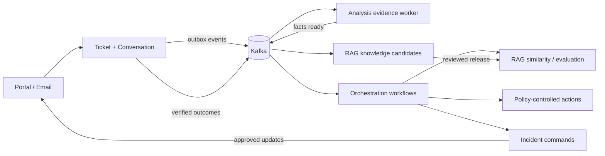

# ResolveIQ Part 2 Differentiated Features Implementation Plan

> **Status:** Reviewed implementation specification (2026-09-10); implementation gates remain unverified
> **Baseline:** Part 1 completion was previously recorded; Phase 0 must revalidate the current checkout and deployment before relying on it
> **Scope:** All five differentiated features defined in `RESOLVEIQ_BEYOND_PARITY_ROADMAP.md`
> **Primary stack:** Java 21, Spring Boot, Kafka, PostgreSQL/pgvector, MinIO, React and TypeScript
> **Execution rule:** Deliver one independently demonstrable vertical slice at a time. Do not begin the next feature while the current feature's required gate is red.
> **Required review decisions:** Section 22 is part of the implementation contract, not optional future work. It resolves dependencies, security boundaries and acceptance details for sections 5–20.

## 1. Product outcome

Part 2 turns ResolveIQ from an AI-assisted ticketing application into a governed support-resolution platform. The completed system must prove one connected real-life story:

1. a customer reports a failure through email or the portal and supplies evidence;
2. ResolveIQ preserves that conversation across channels;
3. evidence processing safely extracts useful technical facts;
4. similar-ticket detection recognizes that the problem affects more customers;
5. an incident manager approves a proactive communication;
6. an agent receives a citation-backed resolution and an exact proposed action;
7. deterministic policy and a human approval boundary control execution;
8. retries do not duplicate the external operation;
9. the customer confirms whether the resolution worked; and
10. only sanitized, evaluated and approved learning becomes published knowledge.

The LLM may classify, summarize, extract candidates and draft text. It must never decide authorization, financial limits, identity merging, consent, incident transitions, notification scope, retention, external command execution or knowledge activation.

## 2. Scope and delivery boundaries

### 2.1 Required features

| Feature | Real-world pain solved | First production-shaped slice |
|---|---|---|
| Support Incident Radar | Support teams investigate hundreds of duplicates during one outage | Detect a billing/API incident from recent tickets, approve it, link affected tickets and publish one update |
| Policy-controlled resolution actions | A useful answer still leaves an agent switching systems to fix the issue | Simulated duplicate-charge refund and account unlock with policy, approval, idempotency and reconciliation |
| Omnichannel continuity | Customers repeat context when moving between email, portal and a human | Portal plus signed email webhooks, canonical conversation, verified identity link and correct reply channel |
| Multimodal Evidence Lab | Screenshots, PDFs, logs and videos contain the actual diagnostic facts | Screenshot/PDF/log extraction first; then short audio/video with failure timestamps |
| Verified Resolution Flywheel | `RESOLVED` does not prove the customer was helped | Outcome feedback, reopen/repeat signals, sanitized knowledge candidate, evaluation gate and rollback |

### 2.2 Explicit non-goals for Part 2

- No autonomous refunds, account changes, incident publication or knowledge publication.
- No real banking, identity-provider or shipping credentials in the portfolio environment.
- No arbitrary model-generated tool name, URL, SQL, shell command or JSON schema.
- No automatic customer identity merge based only on fuzzy similarity.
- No unrestricted storage or model processing of raw secrets, payment data or authentication tokens.
- No custom ML training platform; use deterministic clustering/evaluation plus configured model adapters.
- No Kafka Streams, Flink, service mesh, separate vector database or workflow engine unless measurements prove the current stack insufficient.
- No attempt to implement every possible channel or action. Two channels and two actions must be deep and reliable before adding breadth.

## 3. Real-life scenarios that drive the design

### Scenario A — Payment gateway degradation

- Twenty customers report a pending or duplicate authorization within fifteen minutes.
- Reports arrive through portal and email, with different wording and invoice references.
- Some tickets are legitimate isolated disputes and must not join the incident.
- ResolveIQ proposes one cluster, shows the common error fingerprint and links only sufficiently similar tickets.
- A team lead confirms the incident and approves a customer-safe update.
- An agent later proposes a refund for one genuinely duplicated settled charge.
- A policy blocks amounts above the agent's limit and requires a team lead.
- A provider timeout is reconciled before any safe retry with the same provider key; an uncertain result is never treated as permission to submit another refund.

### Scenario B — SSO certificate expiration

- Customers send screenshots and logs containing `SAML_SIGNATURE_INVALID`.
- OCR and log parsing extract the error while secrets and email addresses are redacted.
- Incident correlation associates the spike with a fictional certificate deployment event.
- A customer moves from email to the portal and sees the same conversation and incident update.
- After engineering restores the certificate, linked customers are invited to verify recovery. Incident resolution never automatically resolves or closes individual tickets.

### Scenario C — Locked account after suspicious login

- The customer asks for an unlock and includes text attempting to instruct the model to bypass policy.
- AI may identify `ACCOUNT_LOCKED`, but the action framework ignores embedded instructions.
- Current account state is fetched from a simulated identity provider.
- Policy requires verified customer identity, an active ticket and an authorized agent.
- Approval is bound to the normalized user ID and action digest; changing the user invalidates approval.
- Unlock executes once, active sessions are optionally revoked, and reconciliation confirms the new state.

### Scenario D — Video evidence of a checkout failure

- A customer uploads a short screen recording.
- The original remains quarantined until scanning succeeds.
- Frame sampling and OCR find an error modal at 00:42.
- The agent sees a redacted preview, extracted error code and “jump to failure” marker.
- The raw file is available only to roles with original-evidence permission, and every download is audited.

### Scenario E — An answer looked correct but did not work

- An agent sends a grounded resolution and marks the ticket resolved.
- The customer selects **No**, provides a reason and reopens the ticket.
- That outcome reduces the resolution's effectiveness score and creates a content-gap signal.
- Several later successful resolutions produce a sanitized knowledge candidate.
- A frozen retrieval evaluation shows improvement without regression.
- A Knowledge Manager approves a new version; an administrator can atomically roll it back if monitored outcomes worsen.

## 4. Architecture and ownership

### 4.1 Service ownership

| Capability/data | Owner | Implementation shape |
|---|---|---|
| Incident, cluster membership, customer impact, incident updates | `ticket-service` | New `incident` domain module because tickets, affected customers and communication state are its business data |
| Ticket similarity and cluster-candidate retrieval | `rag-service` | Tenant-scoped embedding/search API; it returns candidates and scores but does not create incidents |
| Cluster detection schedule and cross-service incident workflow | `ai-orchestration-service` | Durable workflow and event coordination using the existing outbox/retry model |
| Resolution proposal, policy, approval, execution and reconciliation | `ai-orchestration-service` | New `resolutionaction` domain module with ports/adapters and simulated providers |
| Canonical conversation, channel messages, consent and delivery state | `ticket-service` | Extends the existing ticket/message aggregate and owns external-message idempotency |
| Email/provider adapters | `ticket-service` | Adapters behind `ChannelAdapter`; no channel-specific logic in controllers or domain objects |
| Evidence upload, ownership, quarantine and retention | `ticket-service` | Extends the existing attachment boundary and MinIO adapter |
| Evidence extraction/model processing | `ai-analysis-service` | An asynchronous worker profile from the same module; independently deployable without creating a new bounded context |
| Evidence embeddings and evidence-aware retrieval | `rag-service` | Stores only sanitized chunks and source references, never raw files |
| Customer outcomes, reopen and repeat-contact signals | `ticket-service` | Outcome belongs to the ticket/conversation lifecycle |
| Knowledge candidates, evaluation releases and rollback | `rag-service` | Extends the verified knowledge lifecycle and retrieval evaluation boundary |
| Roles and fine-grained permissions | `auth-service` | Adds permissions/claims while keeping identity as source of truth |
| UI composition | React frontend | Calls owning APIs; never derives authorization or authoritative state locally |

### 4.2 Why no broad service expansion

Incident management, channels and outcomes are ticket-domain concepts. Resolution actions are durable workflows. Knowledge releases belong to RAG. Splitting each into a service would increase deployment and consistency complexity without an independent team or load boundary.

Multimodal processing is the exception at deployment level: OCR, document parsing and video/audio processing are CPU/memory heavy and operate on untrusted files. Run an `ai-analysis-service` worker deployment consuming evidence jobs, with separate resource limits and scaling, while sharing the same code module and owned analysis schema.

### 4.3 Cross-feature event flow



Every arrow crossing a service boundary is either a versioned event or a bounded, authenticated API call. Services never read another service's schema.

## 5. Common engineering contracts

### 5.1 Package pattern

Each new bounded module follows the existing hexagonal style:

```text
domain/model
domain/repository
application/dto
application/port
application/service
adapter/in/web
adapter/in/messaging
adapter/out/persistence-or-provider
config
```

Controllers validate transport concerns and call application services. Domain objects own state transitions. Provider-specific request/response formats stop at adapters.

### 5.2 Identity, tenancy and authorization

- `tenantId` and actor identity come only from validated JWT/service tokens.
- Every table that holds tenant business data contains `tenant_id` and tenant-leading indexes.
- Every repository lookup includes tenant scope. A bare `findById` is forbidden for business access.
- Add fine-grained permissions without replacing the six roles:
  - `INCIDENT_APPROVE`
  - `INCIDENT_PUBLISH`
  - `ACTION_APPROVE_LOW_RISK`
  - `ACTION_APPROVE_FINANCIAL`
  - `EVIDENCE_VIEW_ORIGINAL`
  - `CONVERSATION_MERGE`
  - `KNOWLEDGE_RELEASE_APPROVE`
- Admin may assign permissions through policy-backed role templates; the browser does not infer permission from role labels.
- High-impact approvals require recent authentication and record authentication time.

### 5.3 Event contract

All new Kafka events use `EventEnvelope`, UUID `eventId`, integer version, tenant, aggregate type/ID, occurred time, correlation ID and causation ID. Consumers record `(event_id, consumer_group)` in the same local transaction as their business mutation.

Naming convention:

```text
resolveiq.incident.proposed
resolveiq.incident.updated
resolveiq.action.execution_requested
resolveiq.action.execution_completed
resolveiq.conversation.message_received
resolveiq.evidence.processing_requested
resolveiq.evidence.processing_completed
resolveiq.resolution.outcome_recorded
resolveiq.knowledge.candidate_created
```

Do not encode versions in topic names. Keep event version in the envelope, matching the Part 1 canonical event convention.

### 5.4 Idempotency and concurrency

- HTTP mutation commands require `Idempotency-Key` where a retry could duplicate work.
- Store request hash, actor, command type, result reference and expiration with the key.
- Reusing a key with different normalized input returns `409`.
- Aggregate rows use optimistic versioning; state commands require the expected version/ETag.
- External actions additionally use a stable provider idempotency key derived from tenant, proposal ID and action digest.
- Webhook idempotency uses `(tenant, provider, external_event_id)` with a unique constraint.
- Scheduled detectors use database leases or `FOR UPDATE SKIP LOCKED`, never in-memory locks.

### 5.5 Audit and explainability

Persist for every important decision:

- actor and effective permissions;
- policy/model/prompt/algorithm version;
- sanitized input hash;
- deterministic rule results and AI findings separately;
- approval state and approver;
- correlation/causation IDs;
- before/after state references;
- external provider request/result identifiers;
- timestamps, latency and failure code.

Do not persist chain-of-thought. Store concise explanations, evidence IDs, rule matches and validated structured output.

### 5.6 Feature flags

Flags are tenant-scoped and default off during rollout:

- `incident_radar_enabled`
- `resolution_actions_enabled`
- `email_channel_enabled`
- `multimodal_processing_enabled`
- `resolution_flywheel_enabled`

Flags gate both UI and backend commands. A hidden button is not an authorization control.

### 5.7 Shared UX rules

Part 2 inherits the current ResolveIQ color tokens, typography, focus states, dark theme and responsive shell. Add no unrelated visual system.

- Blue: normal primary actions and links.
- Purple: AI-generated recommendation or extraction.
- Amber: awaiting approval, degraded state or medium risk.
- Red: destructive/high-risk, policy denial, security finding or breached incident.
- Green: reconciled, verified or successfully completed—not merely submitted.
- Every AI-derived item is labelled and paired with evidence; show confidence only when defined and measured, otherwise show uncertainty rather than a fabricated percentage.
- Every action panel shows the authoritative backend state after mutation.
- Destructive or externally visible commands use a confirmation summary and never rely on toast-only feedback.
- Empty, loading, partial, stale, permission-denied and provider-unavailable states must be designed explicitly.

## 6. Feature 1 — Support Incident Radar

### 6.1 User outcome

Detect a shared customer-impacting problem early, reduce duplicate investigation and communicate consistently without allowing AI to declare or publish an incident.

### 6.2 Personas and permissions

- Customer: views incidents affecting their account/product and subscribes to updates.
- Agent: sees linked incident, suggests linking/unlinking and avoids duplicate investigation.
- Team Lead/Incident Manager: confirms proposals, changes state and approves updates.
- Administrator: configures thresholds/components/integrations.
- Auditor: reads cluster evidence, decisions and publication history.

### 6.3 Incident state machine

```text
PROPOSED -> INVESTIGATING -> IDENTIFIED -> MONITORING -> RESOLVED
    |
    +-> DISMISSED

Incident update (separate aggregate):
DRAFT -> AWAITING_APPROVAL -> APPROVED -> PUBLISHED
             |                  |
             +-> REJECTED        +-> CANCELLED
```

Rules:

- Detection creates only `PROPOSED`.
- `INVESTIGATING` requires `INCIDENT_APPROVE`.
- Customer publication requires an approved `incident_update` even if the incident is confirmed.
- `RESOLVED` requires a resolution summary and creates follow-up work, not bulk ticket transitions. Phase 1 uses portal follow-up messages; Phase 5 adds resolution-outcome tracking.
- A cancelled update does not cancel its incident. Editing approved text or expanding its audience invalidates approval; published content is immutable and corrected by a new update.
- Dismissed proposals retain evidence and a reason to tune thresholds.

### 6.4 Data model in `ticket_schema`

`support_incidents`

- `id`, `tenant_id`, `incident_number`, `title`, `status`, `severity`
- `detected_at`, `confirmed_at`, `resolved_at`
- `owner_user_id`, `created_by`, `version`
- `summary`, `root_cause`, `resolution_summary`
- `detection_algorithm_version`, `cluster_confidence`

`incident_clusters`

- `id`, `tenant_id`, `incident_id nullable`, `window_start`, `window_end`
- `centroid_reference`, `centroid_hash`, `ticket_count`, `baseline_count`, `anomaly_score`
- `dominant_category`, `product`, `region`, `error_fingerprints JSONB`
- `status`, `explanation`, `algorithm_version`

`incident_ticket_links`

- `incident_id`, `ticket_id`, `link_source`, `similarity_score`
- `linked_by`, `linked_at`, `unlinked_at`, `unlink_reason`
- unique `(incident_id, ticket_id)`

`incident_components`, `incident_updates`, `customer_impacts`, `notification_subscriptions`, `notification_deliveries` store component state, approved messages, per-customer impact and delivery outcome.

### 6.5 Detection algorithm

Run per tenant on `TicketCreated` and on a periodic recovery scan:

1. Normalize subject, description and sanitized evidence facts.
2. Create/reuse the ticket embedding through RAG.
3. Restrict candidates by tenant, configurable time window, language and compatible product/category.
4. Use vector similarity to find neighbors; require deterministic minimum similarity.
5. Apply error-code/fingerprint boosts and explicit incompatibility penalties.
6. Build deterministic groups with centroid and pairwise compatibility checks; connected-neighbor chaining alone must not combine incompatible symptoms.
7. Compare current group count with a rolling tenant/product baseline.
8. Propose only when absolute count and anomaly ratio both pass configuration.
9. Store the candidate IDs, scores and algorithm version used.
10. Never auto-merge an unrelated low-confidence ticket; place it in a review list.

Initial local defaults: 15-minute window, at least 8 unique customers, at least 10 tickets, similarity at least 0.82 and current volume at least 3x baseline. Values are configuration, not source-code constants, and should be tuned from the synthetic evaluation dataset.

### 6.6 Telemetry/deployment correlation

Define a `SignalAdapter` port returning normalized `OperationalSignal` records. Implement deterministic local adapters for fictional deployment and monitoring events. A real webhook adapter can follow after the core flow.

Correlation may increase confidence and explain timing, but it cannot create or confirm an incident by itself. Store source, external ID, component, observed time, sanitized attributes and correlation score.

### 6.7 APIs

- `GET /api/v1/incidents?status=&severity=&page=&size=`
- `GET /api/v1/incidents/{id}`
- `GET /api/v1/incidents/proposals`
- `POST /api/v1/incidents/{id}/confirm`
- `POST /api/v1/incidents/{id}/dismiss`
- `POST /api/v1/incidents/{id}/transition`
- `POST /api/v1/incidents/{id}/tickets/{ticketId}/link`
- `DELETE /api/v1/incidents/{id}/tickets/{ticketId}`
- `POST /api/v1/incidents/{id}/updates` creates a draft
- `POST /api/v1/incidents/{id}/updates/{updateId}/approve`
- `POST /api/v1/incidents/{id}/updates/{updateId}/publish`
- `GET /api/v1/customer/incidents/active` returns only incidents affecting the authenticated customer
- `POST /api/v1/customer/incidents/{id}/subscriptions`

Draft and approve are separate commands. The same actor may not approve their own high-severity update when two-person approval is enabled.

### 6.8 UI

Add Team Lead navigation **Incident Radar**:

- summary cards: proposed, active, customers affected and mean detection time;
- live volume chart with baseline and threshold, never an unlabeled AI score;
- proposal list with sample tickets, common symptoms, error codes and exclusions;
- incident detail with state timeline, component impact, linked tickets and signals;
- side-by-side customer update draft and exact audience count;
- confirm, dismiss, link, unlink, approve and publish controls based on permission;
- delivery result table with pending/sent/failed counts and retry control.

Customer portal shows an accessible incident banner only when `customer_impact` includes that customer. “Still need help” preserves incident context on the new ticket.

### 6.9 Failure handling

- Embedding unavailable: queue detection retry; ticket creation remains successful.
- Detector duplicate run: unique cluster window/fingerprint and leased jobs prevent duplicate proposals.
- Notification provider unavailable: persist each delivery, retry with backoff and show partial state.
- Incident update changed after approval: content digest mismatch invalidates approval.
- Incident resolution fan-out: process linked tickets in batches with per-ticket idempotency.

### 6.10 Tests and gate

- Unit: similarity compatibility, baseline/anomaly calculation and state transitions.
- PostgreSQL integration: pgvector candidates, tenant isolation and concurrent detector lease.
- Kafka integration: duplicate `TicketCreated` creates one membership/proposal.
- Security: foreign-tenant incident and customer-impact IDOR attempts return no data.
- Browser: create threshold tickets, confirm proposal, approve update, customer sees banner, resolve without duplicate ticket transitions.
- Evaluation fixture: relevant and unrelated tickets with expected cluster IDs, precision, recall and false-link rate.

**Gate:** one deterministic run links the expected outage tickets with at least 90% precision on the curated dataset, leaks no tenant/customer details and publishes exactly one approved update per audience/delivery key.

## 7. Feature 2 — Policy-Controlled Resolution Actions

### 7.1 User outcome

Allow agents to resolve common problems from the support workspace while ensuring model output cannot directly perform a state-changing operation.

### 7.2 Initial action catalog

Implement two actions end to end:

1. `REFUND_DUPLICATE_CHARGE`
   - inputs: customer account, payment reference, currency, amount, reason code;
   - preconditions: payment is settled, duplicate relation verified, refundable balance sufficient;
   - compensation: `NON_COMPENSATABLE` in the initial slice; a refund is not a reversible database update. Recovery requires an audited manual decision, not another debit.
2. `UNLOCK_ACCOUNT`
   - inputs: verified user ID, unlock reason, revoke-sessions flag;
   - preconditions: account is locked, identity verification is recent, actor has permission;
   - compensation: `NON_COMPENSATABLE` in the initial slice; relocking and session revocation are separate security operations, not truthful rollback of an unlock.

Additional action types remain registry placeholders until these two pass all gates.

### 7.3 State machine

```text
DRAFT -> PROPOSED -> POLICY_DENIED
                  -> AWAITING_APPROVAL -> APPROVED -> EXECUTING -> SUCCEEDED -> RECONCILED
                           |                |            |
                           +-> REJECTED     +-> EXPIRED  +-> EXECUTION_UNKNOWN
                                                        +-> FAILED_RETRYABLE
                                                        +-> FAILED_FINAL
EXECUTION_UNKNOWN -> SUCCEEDED | FAILED_RETRYABLE | MANUAL_REVIEW
FAILED_RETRYABLE -> EXECUTING (only after fresh policy/approval validation)
```

An approval is bound to a versioned canonical digest including tenant, ticket, proposal, action type, normalized input, provider-state version, policy version, required approvals and expiry (section 22.4). Any material input/current-state/policy change invalidates it. Reconciliation mismatch enters `MANUAL_REVIEW`, never fabricated success. Compensation endpoints reject unsupported actions; adding a compensatable action requires its own reviewed recovery state machine.

### 7.4 Data model in `orchestration_schema`

`resolution_action_proposals`

- identity/tenant/ticket/action type/status/risk level
- sanitized normalized input JSONB and input hash
- AI rationale/evidence IDs separated from authoritative input
- policy version, current-state version, expiry and optimistic version

`action_policy_decisions`

- proposal, decision, matched rules, required permissions, approval count/roles, financial limit, reason codes

`action_approvals`

- proposal, actor, decision, approved digest, authentication time, comment; unique proposal/actor/digest

`action_executions`

- attempt, provider, provider idempotency key, request hash, provider reference, status, sanitized response, timestamps/error

`action_reconciliations` and `action_compensations` record observed state and recovery decisions. No credential or full payment instrument is persisted.

### 7.5 Components and patterns

```java
interface ResolutionAction<I, O> {
    ActionType type();
    Class<I> inputType();
    CurrentState fetchCurrentState(ActionContext context, I input);
    ValidationResult validate(ActionContext context, I input, CurrentState state);
    ExecutionResult<O> execute(ActionContext context, I input, String idempotencyKey);
    ReconciliationResult reconcile(ActionContext context, I input, O output);
    CompensationResult compensate(ActionContext context, I input, O output);
}
```

Implement:

- explicit `ActionRegistry`, no reflection-based arbitrary tool discovery;
- typed Jackson records and JSON-schema validation;
- deterministic `ActionPolicyEngine` with versioned policies;
- `ApprovalService` and action digest;
- provider ports with `SimulatedPaymentAdapter` and `SimulatedIdentityAdapter`;
- durable execution/reconciliation workflows;
- credential adapter reading environment/secret references only;
- immutable execution audit.

### 7.6 Example policies

- Customer text and attachment content can never satisfy an approval.
- Agent refund limit: up to tenant-configured minor units, default fictional USD 5,000 cents.
- Higher amount: team lead plus financial approval permission.
- Critical/high-risk action: two distinct approvers.
- Account unlock: recent verified identity event required; no email-string-only identity.
- Any denied fraud/compliance flag blocks action regardless of AI confidence.
- Proposal expires after configured time or any authoritative state change.
- Customer-visible confirmation is generated only from reconciled result fields.

### 7.7 APIs

- `POST /api/v1/tickets/{ticketId}/resolution-actions/propose`
- `GET /api/v1/tickets/{ticketId}/resolution-actions`
- `GET /api/v1/resolution-actions/{id}`
- `POST /api/v1/resolution-actions/{id}/evaluate-policy`
- `POST /api/v1/resolution-actions/{id}/approve`
- `POST /api/v1/resolution-actions/{id}/reject`
- `POST /api/v1/resolution-actions/{id}/execute`
- `POST /api/v1/resolution-actions/{id}/retry`
- `POST /api/v1/resolution-actions/{id}/reconcile`
- `POST /api/v1/resolution-actions/{id}/compensate`

Execution endpoint requires approved digest, expected aggregate version and idempotency key. It returns `202` and a workflow reference, not fabricated immediate success.

### 7.8 UI

Add **Resolution Actions** to the Agent ticket workspace:

- AI proposal label, rationale and cited evidence;
- authoritative current-state lookup result;
- exact customer/account/payment reference, amount/currency and flags;
- before/after preview generated from normalized backend data;
- matched policy, risk, required approvals and expiry;
- approve/reject/execute controls separately;
- immutable attempt timeline, provider reference and reconciliation result;
- compensation button only when backend reports it is supported and permitted.

Never render the AI narrative as the confirmation source. Confirmation uses typed normalized fields.

### 7.9 Failure handling

- Provider timeout after submission: mark `EXECUTION_UNKNOWN`, reconcile before retrying; unresolved ambiguity requires manual review.
- Same provider key: return recorded operation.
- Policy service failure: fail closed; do not execute.
- Approval race/state change: optimistic conflict and approval invalidation.
- Compensation unavailable: display `NON_COMPENSATABLE`, do not offer a fake rollback.
- Kafka unavailable: command/outbox commit locally; publisher retries.

### 7.10 Tests and gate

- Unit/property tests for amounts, currencies, permissions, digest stability and policy boundaries.
- Contract tests for both simulated provider adapters.
- Concurrency test: twenty execute requests create one external operation.
- Prompt-injection test: ticket/evidence text cannot select or approve an action.
- Failure test: timeout after provider acceptance reconciles without duplicate refund.
- Browser tests for within-limit agent approval, over-limit denial/team-lead approval and account unlock.
- Audit test reconstructs actor, policy, input digest, provider result and reconciliation.

**Gate:** controlled retry/crash tests produce one provider business operation per intended action, every change is policy/approval/audit backed, and no AI-controlled field bypasses typed validation. This is not an unconditional distributed exactly-once guarantee; unsupported provider guarantees block automated retry.

## 8. Feature 3 — Omnichannel Continuity and Intelligent Handoff

### 8.1 User outcome

Keep one understandable conversation when a customer moves between the portal and email, and hand it to a human without losing evidence, promises or attempted resolutions.

### 8.2 Initial channels

- `PORTAL`: current authenticated web experience.
- `EMAIL`: inbound signed webhook plus outbound adapter; use a deterministic local mailbox/provider simulator in Compose and a provider-neutral contract.

Slack, Teams and WhatsApp are deferred beyond the required Part 2 release. Uploaded audio transcription belongs to Feature 4; live voice integration is deferred. Completion claims must explicitly state portal/email coverage, not all-channel support.

### 8.3 Canonical conversation model in `ticket_schema`

`conversations`

- `id`, `tenant_id`, `ticket_id`, `status`, `primary_customer_id`, `assigned_agent_id`, `version`
- `handoff_state`, `handoff_requested_at`, `preferred_channel`

`conversation_participants`

- internal user or external identity reference, role, verification state, joined/left timestamps

`channel_identities`

- provider/channel, hashed normalized address, encrypted display address where needed, verified customer link, confidence, verification method/time

`channel_message_metadata` (one-to-one extension of existing `ticket_messages`, not a second message-content store)

- message reference, conversation, channel, direction, external message ID, sender identity, reply-to and provider timestamps. Existing `ticket_messages` remains authoritative for content, author and visibility; webhook receipt IDs belong to a separate inbox table.

`delivery_attempts`, `conversation_merge_records`, `consent_records` and `handoff_summaries` preserve delivery, merge/split, legal preference and summary evidence.

Internal notes use an explicit `INTERNAL` visibility enum and can never enter outbound adapter queries.

### 8.4 Channel adapter

```java
interface ChannelAdapter {
    ChannelType channel();
    VerifiedInboundEvent verifyAndNormalize(WebhookRequest request);
    DeliveryReceipt send(OutboundMessage message, String idempotencyKey);
    DeliveryStatus fetchStatus(String providerMessageId);
}
```

Provider webhook controllers perform raw-body signature validation, timestamp tolerance and replay detection before JSON deserialization into business commands.

### 8.5 Identity resolution

Deterministic resolution order:

1. verified provider identity already linked to a customer;
2. signed portal linking challenge initiated by authenticated customer;
3. verified email magic-link challenge;
4. high-confidence suggestion placed in manual review;
5. otherwise create an unverified external participant in a restricted pending-intake conversation, not a ticket with a fabricated customer. Current tickets require a non-null customer; promote intake atomically after verification.

Never merge solely because display name or message content is similar. Merge requires `CONVERSATION_MERGE` and records source/target, actor, reason and reversible split metadata.

### 8.6 APIs and webhooks

- `POST /webhooks/v1/email/{tenantPublicKey}` raw signed inbound endpoint
- `POST /api/v1/customer/channel-identities/email/challenge`
- `POST /api/v1/customer/channel-identities/email/verify`
- `GET /api/v1/conversations/{id}`
- `GET /api/v1/conversations/{id}/timeline`
- `POST /api/v1/conversations/{id}/messages`
- `POST /api/v1/conversations/{id}/handoff`
- `POST /api/v1/conversations/{id}/merge`
- `POST /api/v1/conversations/{id}/split`
- `PATCH /api/v1/customer/channel-preferences`
- `PATCH /api/v1/customer/communication-consent`
- `POST /api/v1/deliveries/{id}/retry`

### 8.7 Intelligent handoff

The model may draft a structured summary containing issue, verified facts, attempted steps, promised actions, sentiment and open questions. The backend validates references against persisted messages/evidence/action results. Unsupported claims are removed and listed as findings.

Handoff is complete only after assignment succeeds. Until then it remains `REQUESTED` or `QUEUED`; the UI never claims a human has joined prematurely.

### 8.8 UI

Customer:

- unified chronological history with channel and AI/human badges;
- preferred reply channel and consent settings;
- “Talk to a person” with actual queue state and response estimate;
- linking challenge when an email identity is not verified.

Agent:

- timeline grouped by day with portal/email badges and delivery state;
- clear separation of customer-visible messages and internal notes;
- identity confidence/verification card;
- merge review comparing both conversations before confirmation;
- evidence-backed handoff summary with source links;
- reply-channel selector restricted by consent and verified identity.

### 8.9 Failure handling

- Duplicate webhook: return provider-compatible success and reference existing message.
- Invalid/expired signature: `401`, security audit and no business record.
- Outbound provider failure: persist failed attempt, preserve message, retry or offer portal fallback.
- Out-of-order events: order timeline by provider occurrence plus ingestion sequence; state handlers tolerate late status callbacks.
- Unknown identity: allow generic support intake but suppress private account/ticket details.
- Merge mistake: authorized split restores original conversation associations without deleting messages.

### 8.10 Tests and gate

- Signed webhook fixtures: valid, bad signature, stale timestamp and replay.
- Provider contract tests: send, bounce, delay and duplicate callback.
- Identity tests: verified link, ambiguous match/manual review and foreign tenant.
- Visibility tests: internal note never selected for outbound payload.
- Browser test: email creates conversation, customer verifies it in portal, agent replies by email, customer requests human handoff with full history.
- Accessibility test: channel/identity states are conveyed by text, not color alone.

**Gate:** portal/email form one canonical, tenant-safe timeline; duplicated or reordered provider events do not duplicate/corrupt messages; internal notes never leave ResolveIQ.

## 9. Feature 4 — Multimodal Support Evidence Lab

### 9.1 User outcome

Turn safe customer-provided files into navigable diagnostic evidence without exposing raw secrets or allowing attachment text to control the model.

### 9.2 Supported rollout

Slice A:

- PNG/JPEG screenshots: metadata, OCR, UI/error regions.
- PDF invoices/guides: Tika text, page references and redacted facts.
- TXT/LOG/JSON/HAR: encoding checks, log parsing, stack/error fingerprints and secret redaction.
- CSV: bounded rows/columns, formula-injection neutralization and schema summary.

Slice B after A passes:

- audio up to configured minutes: transcription with timestamps;
- MP4/WebM short recordings: metadata, audio transcript, scene/frame sampling and failure chapters.

### 9.3 Evidence state machine

```text
Upload/scan: UPLOADING -> QUARANTINED -> SCANNING -> CLEAN | REJECTED
Analysis (only CLEAN + consent): QUEUED -> EXTRACTING -> REDACTING -> ANALYZING -> READY
Analysis stage failures: PARTIAL (safe artifacts only) | FAILED | BLOCKED_REDACTION
Consent absent/revoked: NOT_REQUESTED | CANCELLED
Any stored source: RETENTION_EXPIRED or deletion request -> TOMBSTONED -> DELETED
```

Raw upload success never means evidence is ready. Only `READY`/permitted `PARTIAL` derivatives can enter retrieval or model context.

### 9.4 Data ownership

Extend ticket attachment metadata with upload session, quarantine key, retention class, consent, processing status and evidence summary.

In `analysis_schema` add:

- `evidence_jobs`: attachment reference, media type, pipeline/status, attempt, lease, tool versions and errors;
- `evidence_artifacts`: artifact type, redacted object reference, page/frame/time range, checksum and sensitivity;
- `evidence_observations`: typed error code, timestamp, stack fingerprint, invoice fact, UI label, reproduction step or transcript segment;
- `evidence_redactions`: category, source range/bounding box/time range and irreversible mask method;
- `evidence_model_invocations`: links to the existing governance record.

RAG stores sanitized evidence chunks with tenant, ticket, attachment, artifact, page/time metadata and active retention state.

### 9.5 Pipeline and adapters

1. Ticket service completes upload to quarantine and emits `EvidenceProcessingRequested` only after malware scan and consent.
2. Analysis worker claims the job idempotently and obtains a short-lived internal signed URL.
3. Validate magic bytes again; apply decompression, page, row, duration and pixel limits.
4. Extract metadata/text with Apache Tika or format-specific parser.
5. Run sandboxed local OCR, frame extraction and transcription as needed to locate sensitive text, image regions and audio segments; these steps may inspect quarantined raw content without external network access.
6. Scan extracted content and create redacted text/image/audio/video derivatives with separate keys/checksums. Text-only redaction does not sanitize the original pixels or audio.
7. Permit external model adapters only after a successful sanitization policy check on the exact derivative sent. Unsupported redaction blocks external processing, not a silent raw upload.
8. Validate observations and attach source coordinates/timestamps.
9. Send only sanitized chunks to RAG for embedding.
10. Emit ready/partial/failed event; ticket service updates customer/agent status.

Ports:

- `DocumentExtractionPort`
- `OcrPort`
- `LogAnalysisPort`
- `TranscriptionPort`
- `VideoFrameSamplingPort`
- `MultimodalAnalysisPort`
- `EvidenceObjectAccessPort`

Fixture-output adapters are for orchestration tests only. Feature completion requires installed parser/OCR/media/transcription adapters processing actual fixture bytes, with versions and measured outputs recorded. Tool invocation uses fixed binaries/arguments—never raw shell assembled from filenames or extracted text.

### 9.6 Security limits

- Per-tenant size/quota, file-count and processing-minute limits.
- Reject archives initially to avoid decompression bombs.
- Sanitize filenames and generate object keys.
- Disable active PDF content; never render untrusted HTML/HAR inline.
- CSV values beginning with spreadsheet formula characters are escaped in downloads/previews.
- Raw and redacted objects have separate permission checks and audit events.
- Prompt-injection findings are stored as observations but stripped from executable/model instruction channels.
- Browser content uses an authenticated streaming endpoint with range support. Ordinary storage-signed URLs are bearer credentials, not audience-bound or immediately revocable; restrict them to short-lived internal worker access and never log them.
- Retention/deletion cascades to derived objects and RAG chunks through idempotent jobs.

### 9.7 APIs

- `POST /api/v1/tickets/{id}/evidence/uploads` creates upload session
- `POST /api/v1/tickets/{id}/evidence/{attachmentId}/consent`
- `GET /api/v1/tickets/{id}/evidence`
- `GET /api/v1/evidence/{id}`
- `GET /api/v1/evidence/{id}/artifacts`
- `GET /api/v1/evidence/{id}/observations`
- `GET /api/v1/evidence/{id}/content?variant=redacted|original`
- `POST /api/v1/evidence/{id}/reprocess`
- `DELETE /api/v1/evidence/{id}` applies retention policy rather than direct object deletion

Original-content endpoint requires `EVIDENCE_VIEW_ORIGINAL`, records a reason and emits a security audit.

### 9.8 UI

Customer upload:

- drag/drop and file picker with supported-type/limit copy;
- per-file upload, scan and processing progress;
- consent checkbox explaining AI processing;
- sensitive-data warning, preview/remove and clear rejected reason.

Agent Evidence Lab:

- chronological evidence cards with ready/partial/failed states;
- redacted preview by default;
- extracted error codes/fingerprints and source location;
- PDF page jump, screenshot bounding-box annotation and video/audio timeline;
- `Jump to failure at 00:42` from persisted timestamp;
- original-access request/control only for permitted users;
- download and access audit indicator.

### 9.9 Failure handling

- Worker crash: lease expires and another worker retries from persisted stage.
- Tool timeout: mark artifact partial/failed without losing original quarantine record.
- Model unavailable: deterministic extraction may still produce `PARTIAL`; never label model analysis complete.
- Redaction failure: fail closed; no external model call or sanitized retrieval chunk.
- Storage failure after metadata: retry using checksum/idempotency and reconcile orphan objects.
- Deletion failure: tombstone immediately blocks access; cleanup retries asynchronously.

### 9.10 Tests and gate

- Fixture corpus: clean/malicious files, wrong magic bytes, oversized dimensions, PDF active content, secrets, CSV formulas and injection text.
- OCR golden test extracts `SAML_SIGNATURE_INVALID` and source bounding box.
- Log golden test groups a seeded stack trace and timestamps.
- Video golden test finds the expected failure chapter within configured tolerance.
- Cross-tenant/original-vs-redacted authorization tests.
- Worker redelivery and lease recovery tests.
- Retention test tombstones access and removes derivatives/index chunks.
- Browser upload/progress/preview/jump-to-failure journey.

**Gate:** supported fixture evidence becomes correctly sourced, redacted and searchable; unsafe content never reaches model/retrieval; video evidence produces the expected timestamp; deletion makes every variant inaccessible.

## 10. Feature 5 — Verified Resolution and Knowledge Flywheel

### 10.1 User outcome

Measure whether customers were actually helped and improve knowledge only from successful, sanitized and evaluation-proven outcomes.

### 10.2 Ticket states and outcome rules

Preserve existing `TicketStatus`. Add a separate versioned resolution-attempt lifecycle: `AWAITING_CONFIRMATION -> CONFIRMED | PARTIAL | REJECTED | NO_RESPONSE | SUPERSEDED`. An agent resolving a ticket creates a resolution record and confirmation window atomically. Section 22.7 defines timing, reopen and closed-ticket behavior.

Customer outcome:

- `YES`: verified positive signal; close after policy-defined grace period.
- `PARTLY`: keep/reopen with remaining-problem reason and agent follow-up.
- `NO`: reopen/escalate immediately and create negative outcome signal.
- `NO_RESPONSE`: weak/unknown outcome, never counted as customer-verified success.

Repeat-contact detection uses the same tenant/customer, a configurable time window and semantic/topic compatibility. It creates a suggestion for review when identity/topic confidence is insufficient.

### 10.3 Data model

In `ticket_schema`:

`ticket_resolutions`

- ticket, resolver, response/message/action references, resolved time, solution fingerprint and status

`resolution_outcomes`

- resolution, source (`CUSTOMER`, `REOPEN`, `REPEAT_CONTACT`, `AGENT_CORRECTION`), rating, reason, occurred time, weight

`repeat_contact_signals`

- prior/current ticket, similarity, time delta, matched category/product, status and reviewer

`resolution_scores`

- component scores, final score, formula version and computed time

In `rag_schema`:

`knowledge_candidates`, `candidate_source_cases`, `sanitization_reviews`, `evaluation_dataset_versions`, `evaluation_runs`, `evaluation_case_results`, `knowledge_releases`, `rollback_records`.

Datasets and releases are immutable. A knowledge release points to exact document/version, dataset version, embedding/model configuration, metrics and approver.

### 10.4 Outcome scoring

Use the versioned deterministic formula and eligibility thresholds in section 22.7. The interpretation of its signals is:

- customer Yes: strong positive;
- Partly: small positive/remaining-work penalty;
- No/reopen: strong negative;
- repeat contact within 7 days: negative;
- successful reconciled action: positive only when customer outcome is not negative;
- no response: neutral/unknown;
- agent acceptance alone: workflow metric, not proof of resolution.

Persist every component and formula version. Do not compare tenants with materially different feedback coverage without showing coverage.

### 10.5 Candidate creation and sanitization

Candidate eligibility requires:

- minimum verified outcome score and sample count;
- stable issue/solution pattern across multiple customers when possible;
- no active incident-only workaround presented as permanent policy;
- source tickets and evidence permitted for derived learning;
- deterministic PII/secret scan completed.

The model may draft a generic article or update, but source attribution and sanitization are deterministic/reviewed. Knowledge Manager sees source snippets, removed fields, generalized facts and before/after diff. Raw customer data is never copied into the article.

### 10.6 Evaluation and activation

Before publish:

1. Freeze/version the dataset and current production candidate.
2. Run baseline and proposed retrieval using identical queries/configuration.
3. Compare Recall@5, MRR, zero-result rate, correct abstention, attack behavior and latency.
4. Add targeted cases for the knowledge gap plus regression cases for neighboring topics.
5. Block activation if required thresholds regress beyond configured tolerance.
6. Require `KNOWLEDGE_RELEASE_APPROVE` after the report exists.
7. Publish through the existing atomic knowledge lifecycle.
8. Monitor outcome/retrieval metrics by release version.
9. Guard thresholds request rollback review; an authorized human approves the exact prior release before atomic rollback. Do not autonomously activate knowledge versions.

The system must never tune the evaluation dataset to only the new article. Dataset changes are separately reviewed and versioned.

### 10.7 APIs

- `POST /api/v1/customer/tickets/{id}/resolution-outcome`
- `POST /api/v1/customer/tickets/{id}/reopen`
- `GET /api/v1/tickets/{id}/resolution`
- `GET /api/v1/knowledge/candidates`
- `GET /api/v1/knowledge/candidates/{id}`
- `POST /api/v1/knowledge/candidates/{id}/sanitize`
- `POST /api/v1/knowledge/candidates/{id}/submit-review`
- `POST /api/v1/knowledge/candidates/{id}/evaluation-runs`
- `GET /api/v1/knowledge/evaluation-runs/{id}`
- `POST /api/v1/knowledge/candidates/{id}/release`
- `POST /api/v1/knowledge/releases/{id}/rollback`
- `GET /api/v1/governance/resolution-metrics?from=&to=&team=&articleVersion=`

### 10.8 UI

Customer:

- a post-resolution card asking **Did this solve your problem?**;
- Yes/Partly/No, optional reason, reopen and human-help actions;
- clear state after submission and ability to see follow-up status.

Knowledge Manager:

- content-gap queue sorted by customer impact, not AI confidence alone;
- candidate source cases and outcome distribution;
- sanitization diff with findings requiring acknowledgement;
- proposed article diff and evidence links;
- evaluation baseline/proposed table with pass/fail thresholds;
- publish blocked until review/evaluation gates pass;
- release history and rollback reason.

Administrator/Auditor:

- first-contact resolution, reopen/repeat rates and feedback coverage;
- citation usefulness, suggestion acceptance/edit/rejection;
- article-version outcome and rollback history;
- cost per customer-verified resolution, not cost per model call only;
- drill-down to sanitized auditable records.

### 10.9 Failure handling

- Duplicate feedback: one active customer response per resolution; later change creates history.
- Repeat detector unavailable: process backlog later; ticket operations continue.
- Sanitization uncertain: `NEEDS_MANUAL_REDACTION`, no evaluation/indexing.
- Evaluation worker failure: resumable run with immutable inputs.
- Metrics job lag: dashboard shows computed-through timestamp.
- Release activation failure: old active version remains unchanged.
- Rollback event duplicate: one active version transition through idempotent command.

### 10.10 Tests and gate

- Outcome state tests for Yes/Partly/No/no-response/reopen.
- Repeat-contact dataset with same-customer same-topic and unrelated controls.
- Sanitization tests covering names, emails, payment references, tokens and free-text secrets.
- Evaluation regression fixture that must block publication.
- Atomic release/rollback PostgreSQL integration test.
- Metric reconciliation query compared with API totals.
- Browser journey from customer No/reopen through candidate evaluation and Knowledge Manager publication.

**Gate:** negative outcomes reopen/escalate correctly, no candidate contains source PII, regression blocks release, successful release improves the targeted frozen cases and rollback restores the prior active version.

## 11. Integrated end-to-end workflow

The final showcase test must execute this sequence with fictional data:

1. Signed email webhook creates an SSO support conversation.
2. Authenticated customer verifies the email identity and continues in the portal.
3. Customer uploads screenshot/video evidence and consents to processing.
4. Evidence worker extracts and redacts `SAML_SIGNATURE_INVALID` plus a failure timestamp.
5. Additional fixture tickets cross the incident threshold.
6. Incident Radar proposes one incident and excludes an unrelated password-reset ticket.
7. Team Lead confirms the incident and approves a customer update.
8. Affected customer receives/sees the update without opening a duplicate.
9. Agent sees full channel/evidence/incident context and requests human handoff.
10. For a separate locked-account ticket, ResolveIQ proposes `UNLOCK_ACCOUNT`.
11. Policy validates verified identity and authorization; agent approves exact normalized input.
12. Two concurrent execution requests create one simulated provider operation.
13. Reconciliation confirms unlocked state and the agent sends a result-based message.
14. Customer selects Yes; another negative fixture selects No and reopens.
15. Successful cases create a sanitized knowledge candidate.
16. Evaluation proves targeted improvement with no allowed regression.
17. Knowledge Manager publishes, searches and rolls back the version.
18. Auditor reconstructs the complete event/approval/provider/evaluation trail.

This journey should be automated at API/component level and split into stable Playwright journeys for UI reliability.

## 12. Delivery sequence

### Phase 0 — Contracts, permissions and fixtures

- Add this plan to the roadmap and create ADRs for service ownership, evidence worker deployment and action approval digest.
- Add fine-grained permission claims, recent-authentication/identity-verification contracts, scoped service authorization and authorization tests (section 22.2).
- Verify current gateway routes, lifecycle transitions, message storage, semantic embedding provider and every knowledge activation entry point against section 22 before implementation.
- Define event schemas and compatibility tests before producers/consumers.
- Add tenant feature flags and backend enforcement.
- Build synthetic providers/fixtures for telemetry, payment, identity and email.
- Extend OpenAPI aggregation and CI contract checks.

**Gate:** no business feature yet; permissions, events, flags and simulators are tested and documented.

### Phase 1 — Incident Radar

1. Add incident schema/state machine and read APIs.
2. Add RAG ticket-similarity API and curated clustering dataset.
3. Add detector/recovery workflow and proposal UI.
4. Add manual link/unlink, confirmation and lifecycle.
5. Add update approval, impact audience and deterministic notification adapter.
6. Add customer banner, delivery visibility and integrated tests.

**Gate:** Feature 1 gate in section 6 passes.

### Phase 2 — Resolution Actions

1. Create typed framework, policies, digest and data model.
2. Implement simulated payment lookup/refund/reconciliation.
3. Implement simulated account lookup/unlock/reconciliation.
4. Add approval and execution UI.
5. Add compensation where truthful and failure/unknown-state handling.
6. Add concurrency, prompt-injection and complete audit tests.

**Gate:** Feature 2 gate in section 7 passes.

### Phase 3 — Omnichannel Continuity

1. Introduce canonical conversation model while backfilling existing portal messages.
2. Implement channel adapter and deterministic local email provider.
3. Implement signature/replay/idempotency and delivery callbacks.
4. Add verified identity linking, consent and preferences.
5. Add timeline, reply channel, merge/split and internal-note protections.
6. Add evidence-backed human handoff.

**Gate:** Feature 3 gate in section 8 passes. Add another channel only afterward.

### Phase 4 — Multimodal Evidence Lab

1. Extend quarantine/retention metadata and evidence job contracts.
2. Add worker deployment profile and job lease/recovery.
3. Implement screenshot/PDF/log/CSV deterministic pipelines and redaction.
4. Add evidence UI and RAG sanitized-chunk indexing.
5. Add audio/video adapters, frame sampling and timestamp UI.
6. Add original/redacted authorization, deletion and security corpus.

**Gate:** Feature 4 gate in section 9 passes.

### Phase 5 — Verified Resolution Flywheel

1. Add resolution/outcome/reopen states and customer UI.
2. Add repeat-contact detector and explainable scoring.
3. Add candidate eligibility/sanitization review.
4. Version frozen datasets and evaluation runs.
5. Add release gate, monitoring and atomic rollback.
6. Add reconciled admin/auditor outcome dashboards.

**Gate:** Feature 5 gate in section 10 passes.

### Phase 6 — Integrated hardening and portfolio proof

- Execute the complete workflow in section 11.
- Run load tests for cluster detection, webhook bursts, action concurrency and evidence queues.
- Complete threat-model review and tenant/IDOR matrix.
- Add backup/restore and replay runbooks for new tables/events/objects.
- Extend Kustomize resources, worker HPA/PDB/NetworkPolicy and production configuration guards.
- Capture screenshots and record a concise demonstration only after automated gates pass.

**Gate:** all feature gates and the Part 2 definition of done are green.

## 13. Test and quality strategy

### 13.1 Test layers

| Layer | Required proof |
|---|---|
| Domain unit | State machines, thresholds, policies, approval digest, consent, retention and scoring |
| Property/boundary | Amount limits, time windows, similarity thresholds, size/duration quotas and input hashes |
| Repository integration | Migrations, tenant predicates, uniqueness, leases, optimistic concurrency and atomic release |
| Kafka integration | Duplicate/redelivered/out-of-order events, outbox retries and consumer idempotency |
| Provider contract | Email, payment, identity, OCR/transcription and notification adapters with success/timeout/duplicate/unknown states |
| Security | Role/permission matrix, IDOR, webhook forgery/replay, prompt injection, malicious files and raw/redacted access |
| Evaluation | Cluster precision/recall, extraction goldens, repeat-contact accuracy and retrieval regression |
| Frontend component | State/empty/error flows, confirmation summaries, timeline visibility and accessibility |
| Browser | One stable journey per feature plus six-role access checks |
| Performance | Webhook burst, detector batch, action concurrency, evidence worker backlog and dashboard query latency |

### 13.2 CI gates

Extend CI with:

- JSON/event schema compatibility;
- PostgreSQL/pgvector and Kafka Testcontainers;
- MinIO and deterministic provider simulators;
- malicious evidence fixture scan;
- Playwright feature suites;
- retrieval/cluster/extraction evaluation thresholds;
- dependency, container and secret scanning;
- OpenAPI diff check;
- Kustomize render and policy validation.

Keep fast unit/frontend checks before expensive Compose/browser/media gates.

## 14. Observability and operational targets

### 14.1 Metrics

Incident:

- tickets evaluated/linked/unlinked;
- proposal precision proxy and dismiss reasons;
- time to detect/confirm/update;
- affected customers and notification delivery failures.

Actions:

- proposals, denials, approvals, executions and reconciliation unknowns;
- idempotency-key reuse, duplicate-effect violations and unknown-operation age;
- provider latency/errors and compensation outcomes.

Channels:

- inbound/outbound/deduplicated webhooks;
- delivery success/bounce/delay;
- identity review/merge rates and handoff wait.

Evidence:

- queue depth/age, processing time by type/stage;
- redaction findings, partial/failure and storage bytes;
- original-access audits and retention cleanup lag.

Flywheel:

- feedback coverage, verified resolution/reopen/repeat rates;
- candidate-to-release conversion;
- evaluation regression blocks, article outcomes and rollback rate.

Metrics use bounded labels; never label by ticket, customer, file or provider message ID.

### 14.2 Tracing and logs

- Propagate correlation/causation through API, outbox, Kafka, worker and provider adapter.
- Trace provider calls and job stages without raw message/file/secret content.
- Structured logs include tenant hash, aggregate type/ID, event/attempt and error code.
- Audit business approvals separately from operational logs.

### 14.3 Initial SLO targets

- Portal/email inbound acknowledgement p95 under 1 second, excluding file body upload.
- Incident proposal available within 2 minutes of threshold crossing.
- Approved update fan-out begins within 30 seconds.
- Resolution action command returns workflow acknowledgement under 500 ms.
- Zero duplicate logical messages or external business effects in controlled retry/crash acceptance tests; unknown provider outcomes remain visible and blocked from unsafe retry.
- Screenshot/PDF/log evidence p95 ready under 60 seconds locally; video under 3 minutes for bounded fixtures.
- Outcome dashboards expose a `computedThrough` timestamp and remain within 5 minutes of events.

These are engineering targets for portfolio load, not contractual production SLAs.

## 15. Security and privacy checklist

- Threat model each external webhook/provider and file parser.
- Store provider secrets only in environment/secret manager references.
- Verify raw webhook signature and timestamp before parsing business payload.
- Apply rate limits per public tenant key/source and abuse controls.
- Never expose tenant IDs or existence through customer/public lookup differences.
- Encrypt sensitive channel identity values and hash lookup forms.
- Do not persist full payment instruments, authentication secrets or raw model prompts containing customer data.
- Require explicit processing consent where configured; record consent version.
- Enforce deletion/retention across DB, MinIO, RAG chunks and cached derivatives.
- Treat all ticket, channel and evidence content as untrusted data.
- Require exact human approval for external update/action/release.
- Use two-person approval for configured high-impact operations.
- Audit original evidence access, action execution, identity merge, incident publication and knowledge release.
- Include adversarial tests for indirect prompt injection, forged webhooks, replay, MIME confusion, CSV formula injection, SSRF-like URLs and zip bombs (archives remain rejected).

## 16. Database migration and rollout rules

- Migrations are forward-only, additive first and safe on existing Part 1 data.
- Backfill canonical conversations from existing ticket messages before switching reads.
- Backfill feature states in batches with checkpoints; never hold a migration transaction while embedding or calling providers.
- Add nullable columns/tables, deploy compatible code, backfill, validate, then add constraints.
- Use partial/covering indexes for active incidents, pending jobs, awaiting approvals and unresolved outcomes.
- Test clean database and Part 1 upgrade path in CI.
- Feature flags allow code deployment before tenant enablement.
- Rollback disables new commands but retains read/audit paths and pending recovery workers.
- Event consumers support the prior event version during rolling deployment.

## 17. Local and deployment topology

Local Compose adds only deterministic infrastructure required by the active stage:

- local email/provider simulator;
- fictional payment and identity simulators;
- optional OCR/media tooling image or worker dependencies;
- evidence-worker deployment profile from `ai-analysis-service`.

Kubernetes adds a separate analysis-worker Deployment/HPA/PDB and least-privilege NetworkPolicy. Public webhook traffic enters only through the gateway. Worker pods can reach object storage and configured model providers but are not publicly routable.

Set CPU/memory/time limits for parsers and video processing. Use queue depth/oldest-job age for worker autoscaling if available; otherwise conservative CPU plus backlog alerts.

## 18. Synthetic datasets and demonstration fixtures

All portfolio data is fictional. Add versioned fixtures for:

- at least three outage clusters and unrelated controls;
- payment states covering settled duplicate, pending authorization, already refunded and non-refundable;
- account states covering locked, unlocked, fraud hold and stale identity verification;
- signed email webhook deliveries, duplicates, bounces and out-of-order callbacks;
- screenshots with known OCR labels/error regions;
- PDFs with invoice facts and PII requiring redaction;
- logs/HAR/CSV with errors, secrets and malicious instructions;
- short audio/video with known transcript and failure timestamps;
- positive, partial, negative, reopen and repeat-contact outcomes;
- frozen retrieval regression queries including typos, paraphrases, attacks, conflicts and zero-result cases.

Seed scripts must call authenticated application APIs or dedicated admin/import commands. Do not bypass lifecycle, policy, consent, indexing or audit boundaries with direct SQL except infrastructure/reference fixture setup explicitly documented for tests.

## 19. Documentation required during implementation

For each feature update:

- OpenAPI and event schema examples;
- Mermaid state/sequence diagram;
- ADR for material architectural decisions;
- threat model and permission matrix;
- runbook for retries/replay/provider outage/retention;
- deterministic seed command and manual UI journey;
- automated evidence command and measured result;
- screenshot checklist and interview talking points;
- known limits stated honestly.

Do not mark a feature implemented because its UI exists. Record backend mutation, persistence readback, failure proof and automated journey.

## 20. Part 2 definition of done

Part 2 is complete only when all are true:

- [ ] Incident Radar detects, explains and safely confirms a real fixture cluster while excluding unrelated/foreign-tenant tickets.
- [ ] Approved incident updates reach exactly the intended affected customers with observable delivery outcomes.
- [ ] Refund and account-unlock actions enforce typed input, policy, exact approval, idempotent execution and reconciliation.
- [ ] Portal and email form one verified canonical conversation with webhook security, consent and internal-note isolation.
- [ ] Screenshot/PDF/log evidence is quarantined, redacted, extracted and searchable with source locations.
- [ ] Bounded audio/video evidence produces a verified transcript/failure timestamp without exposing raw secrets.
- [ ] Customer Yes/Partly/No, reopen and repeat-contact signals affect persisted outcome state correctly.
- [ ] Knowledge candidates are sanitized, evaluated against an immutable dataset, approval-gated, atomically released and rollback-capable.
- [ ] Every feature passes tenant/role/permission/IDOR and prompt-injection tests.
- [ ] Outbox, consumer, webhook, provider and command retries are idempotent and tested.
- [ ] Dashboards contain only persisted metrics with freshness/coverage context.
- [ ] Full Java, frontend, Testcontainers, evaluation, Playwright, Compose, OpenAPI, Kubernetes and secret/security gates pass.
- [ ] Architecture, runbooks, UI testing guide and portfolio evidence match measured behavior.
- [ ] The integrated workflow in section 11 is repeatable from a clean seed.

## 21. Instructions for an implementation agent

1. Read this entire file including section 22, Part 1 plan, roadmap and applicable service code before editing.
2. Update a phase checklist before starting; keep only one vertical slice in progress.
3. Preserve current service ownership, event envelope, security and human-approval invariants.
4. Create schema migration and domain tests before UI composition.
5. Add provider behavior behind ports with deterministic local adapters.
6. Never call an external provider inside a database transaction.
7. Never write another service's schema.
8. Never let model output choose an executable class, permission, destination, audience or final state.
9. Implement empty/error/degraded UI alongside the happy path.
10. Add unit, integration, security and browser proof before checking a gate.
11. Update OpenAPI, events, seed data, runbooks and this plan's implementation record in the same feature change.
12. Stop and document a conflict if implementation would weaken tenant isolation, exact approval, idempotency, retention or auditability.

The preferred implementation order is Incident Radar, Resolution Actions, Omnichannel, Multimodal Evidence and Verified Resolution Flywheel. It maximizes reuse and produces an interview-ready milestone after every phase instead of one large unfinished branch.

## 22. Review decisions and mandatory implementation details

Reviewed against the local source and roadmap on 2026-09-10. This is a specification review, not evidence that the features or runtime gates have passed. These decisions refine the broad requirements above; do not substitute a mocked demonstration for their acceptance tests.

### 22.1 Baseline alignment and phase prerequisites

| Observed baseline | Required decision | Phase |
|---|---|---|
| Gateway currently routes all `/api/v1/tickets/**` to ticket-service | Add the more-specific action route first; test gateway dispatch, not just direct service controllers | 0/2 |
| `TicketStatus` already supports `RESOLVED -> IN_PROGRESS`, with terminal `CLOSED` | Keep ticket enum; version resolution attempts separately and preserve terminal history | 5 |
| `ticket_messages` exists and tickets require `customer_id` | Extend canonical messages; pending unverified intake stays separate until linked to a verified customer | 3 |
| `DeterministicEmbeddingAdapter` hashes tokens into a normalized vector | Useful lexical fixture baseline, not semantic paraphrase proof. Run semantic acceptance with a configured real embedding adapter | 1 |
| Knowledge controller exposes legacy publish, version publish and rollback routes | Enforce release authorization/gates in the shared application service so old routes cannot bypass them | 5 |
| Shared service JWT currently conveys a `SYSTEM` role | Add authenticated service identity, allowed operation/audience and tenant scope; `SYSTEM` alone cannot approve actions or authorize arbitrary evidence reads | 0 |
| `EventEnvelope` already defines producer, version and traceparent | Reuse it without an incompatible replacement; catalog actual existing topics and consumers before adding events | 0 |

Phase 0 must record checkout SHA, dirty-state summary, executable test commands and results, enabled providers and outstanding baseline defects. Existing customer search, ticket/reply flow, tenant isolation and knowledge lifecycle must pass. Treat an unavailable dependency as an unverified gate, not a pass. Do not overwrite unrelated work or recreate volumes to obtain a clean result.

Dependency order is deliberate: Phase 1 supports portal updates and a durable notification port; email fan-out is connected in Phase 3. Phase 2 uses authenticated portal identity verification established in Phase 0, not the future email-linking flow. Phase 4 supplies richer evidence to the already-working incident/action APIs. Phase 5 adds customer-outcome tracking without retroactively claiming old incident updates were verified resolutions.

Use separate RAG source types/index queries for public knowledge, staff ticket similarity and ticket evidence. Record model ID, dimension, content hash and indexing generation on every vector. Never mix incompatible embeddings in a search. Model changes require a background rebuild, measured evaluation and approved cutover with the old generation retained for recovery. Missing embeddings are queued for repair; UI reports degraded lexical retrieval honestly.

### 22.2 Authorization, routes and shared command contracts

Default role templates: Customers access only their own permitted records; Agents propose actions and may approve low-risk actions if explicitly granted; Team Leads receive incident approval/publication and financial approval within configured limits; Knowledge Managers receive knowledge-release approval; Administrators manage configuration and grants; Auditors are read-only. These are templates, not automatic universal powers. Original-evidence and conversation-merge permissions are explicit grants, denied by default. High-risk actions require two distinct authorized approvers, neither the proposer. No service principal counts as a human approver.

`auth-service` owns grants, permission-policy versions and recent-authentication attestations. Implement a server-validated step-up flow with a five-minute validity default; refreshing a token must not reset original `auth_time`. Sensitive approvals/execution recheck current grants and tenant membership, not just an old JWT claim. Auth unavailability fails these commands closed. Account-unlock verification binds the verified customer to the exact external account; knowing an email or controlling a webhook is insufficient. The local identity simulator issues test-only verification attestations; production configuration rejects them.

| Public API prefix | Gateway owner / rule |
|---|---|
| `/api/v1/tickets/{ticketId}/resolution-actions/**`, `/api/v1/resolution-actions/**` | Orchestration; higher priority than generic ticket routes |
| `/api/v1/incidents/**`, `/api/v1/customer/incidents/**` | Ticket |
| `/api/v1/conversations/**`, `/api/v1/deliveries/**`, `/api/v1/customer/channel-identities/**`, `/api/v1/customer/channel-preferences`, `/api/v1/customer/communication-consent` | Ticket |
| `/webhooks/v1/email/**` | Ticket webhook adapter; exempt only from user JWT, never from signature, size, rate or replay checks |
| `/api/v1/evidence/**`, `/api/v1/tickets/{id}/evidence/**` | Ticket authorizes first, then calls analysis through a narrowly scoped internal API |
| `/api/v1/customer/tickets/**`, `/api/v1/tickets/{id}/resolution` | Ticket |
| `/api/v1/knowledge/**` | RAG |
| `/api/v1/governance/resolution-metrics` | Ticket; joins local outcome projections, never reads RAG schema |

Add missing routes and method-specific security rules, OpenAPI aggregation, generated frontend types and gateway integration tests together. A backend running without the gateway must still enforce authorization. RAG staff retrieval checks ticket/team access as well as tenant; customer search can never query staff ticket indexes. Tenant equality is necessary but insufficient. Sensitive reads recheck source access if projections are stale; deny rather than expose revoked content.

Every command documents request/response schema, validation limits, required permission, idempotency scope and concurrency version. Use stable problem codes with `400` invalid input, `401` unauthenticated, `403` forbidden (or non-enumerating `404` for inaccessible objects), `409` stale version/idempotency mismatch, `422` policy/state rejection, `429` quota and `503` dependency unavailable. Async accepted work returns `202` with a persisted job reference and polling URL. Paginate collections (default 20, maximum 100), use UTC timestamps and stable ordering, and cap request/search text sizes.

Local transactions commit business state, audit intent and outbox together. Remote audit publication is asynchronous with health alerts; a failed local audit write aborts a sensitive command. Consumers deduplicate in their own transaction, reject/quarantine unknown event versions, and carry aggregate version to prevent out-of-order regression. Include only required sanitized data, not whole tickets/files. Cross-service references have no cross-schema foreign keys. Local composite tenant keys/constraints prevent foreign-tenant parent links.

Scheduled/worker claims use lease expiry plus fencing tokens: only the current owner may commit completion. Persist stage outputs with unique job/stage/generation keys. Bound retries to five attempts with exponential backoff and jitter before DLQ/manual review; security/policy errors are not retried. Recovery after feature disable continues for in-flight reconciliation and deletion, while new work is rejected. API/UI updates must work across two replicas: use broker-backed invalidation or authenticated polling fallback; instance-local SSE alone is not acceptance proof.

### 22.3 Incident detection, audience and notification safety

Add validated product/component/region fields and customer component entitlement/impact mapping before using them as filters. Unknown product is an explicit value, not an inferred entitlement. Customer impact is always within one tenant; never expose another tenant's outage counts or tickets. Normalize timestamps and use a controllable clock in tests.

Detector defaults supplement section 6: run every 60 seconds over the last 15 minutes, with a five-minute overlap for late arrivals; compare against the median count of equal-sized historical windows over the preceding seven days, excluding known incidents. With fewer than 24 reference windows, mark `LOW_BASELINE_CONFIDENCE` and use the absolute customer/ticket floors plus matching error fingerprints; never divide by zero. Otherwise compute ratio using `max(baseline, 1)`. Cap each batch at 500 tickets and checkpoint the remainder.

Sliding windows must not create repeated incidents. Match against an existing active tenant/component/fingerprint cluster before proposing; lock/uniquely constrain that active grouping. Dismissal records a reason and 24-hour configurable cooldown for the same signature, with manual override. Require every new member to satisfy cluster-centroid and incompatibility checks; test the A-similar-B, B-similar-C, A-incompatible-C case. Manual split/unlink retains immutable history and recomputes impact without deleting previous delivery evidence. A recurrence after resolution is a new linked incident, not silent rewriting of history.

An update approval binds exact text, incident version and audience snapshot/version. Removing unsubscribed/ineligible recipients before delivery is permitted and audited; adding recipients requires new approval. One logical delivery per `(tenant, update, recipient, channel)` is enforced in the database. An affected customer added later needs a new approved update or approved audience revision. No recipient receives another customer's details or a visible recipient list. Portal publication is idempotent; email delivery remains subject to provider uncertainty as below. Incident resolution does not mass-close tickets, cancel actions or overwrite individual unresolved disputes.

Acceptance: measure precision >= 0.90 and recall >= 0.80 on a held-out corpus with at least three incident groups, paraphrases, isolated disputes, multilingual/unknown-language exclusions, late arrivals and two tenants. Record membership labels and false links, not just one successful cluster. The real semantic adapter must pass; token-hash fixtures only prove plumbing. Tune thresholds on training fixtures, not the holdout.

### 22.4 Action safety, provider ambiguity and recovery

Define digest v1 using canonical JSON with sorted keys, explicit null handling, normalized identifiers, uppercase ISO currency and integer minor units (never floating-point money). Hash tenant, ticket, proposal, action type, provider/target, all input fields, authoritative provider-state version, policy version, approval requirements and expiry. Persist the canonical bytes/version alongside the digest; ambiguous string concatenation is forbidden. Reject unsupported currencies and arithmetic overflow. Default proposal lifetime is 15 minutes; policy/target changes require reevaluation and new approvals.

Deduplicate both request retries and separately created proposals for the same business operation. For refunds reserve `(tenant, provider, payment, duplicate-relation, action-type)` while active, and track cumulative refunded/reserved minor units under lock. Concurrent proposals cannot each spend the same remaining balance. Support bounded partial refunds only with an explicitly defined cumulative ledger and operation sequence; initial scope is one refund of the verified duplicate settled payment. Pending authorizations cannot be refunded.

Immediately before provider execution, revalidate actor grants, identity proof, fraud holds, action enablement, approval expiry and provider state. Provider adapters must support a conditional version/precondition check or equivalent atomic domain validation; otherwise fail to manual handling rather than pretend the lookup-to-write race is solved. Policy limits include per-action and daily tenant/actor budget, reserved atomically before submission and released only when non-execution is known.

Persist intent and stable provider key before network I/O. Do not hold a DB transaction across the call. A crash after provider acceptance or a lost response enters `EXECUTION_UNKNOWN`; query by stable key/reference. Retry only when provider evidence establishes non-execution and its idempotency guarantee still covers the retry window. Keep operation keys through the configured audit/reconciliation retention, and never generate a new key because an attempt timed out. If provider deduplication expires or lookup cannot establish truth, enter `MANUAL_REVIEW`. Do not retry merely because five polls found no result on an eventually consistent endpoint.

The simulator must persist its own operations separately, survive restart and implement accept-then-timeout, delayed lookup, rejection, conflicting state and repeated-key behavior. Twenty concurrent requests, two application replicas and a crash between provider acceptance/local commit must yield one recorded business effect. Refunding and unlocking remain simulated in the portfolio release; label this in UI, docs and demo. Reconciliation reports expected versus observed state without claiming reversible refunds or restored revoked sessions.

### 22.5 Conversation migration, identity and delivery

Retain `ticket_messages` as canonical content and extend it additively with conversation linkage/channel metadata. Backfill old tickets/messages deterministically in batches; enforce one metadata row per message and preserve existing IDs, visibility, author and ordering. Old APIs delegate to the same message-writing application service. No dual writes to two independent message-content tables. Prove upgrade with preexisting replies and internal notes before switching reads.

Unverified email intake uses separate pending message storage with limited staff access and a seven-day default expiry. No existing account history is disclosed before proof of address control and tenant membership. A provider signature authenticates the webhook sender, not the human `From` header. Thread headers, guessed ticket numbers and `Reply-To` cannot grant access. Bind expiring, single-use link challenges to tenant, authenticated customer and normalized address; hash challenge tokens, rate-limit attempts and audit consumption. Normalize domains case-insensitively but do not globally strip plus-addressing or dots from mailbox names. Store lookup addresses as keyed HMACs rather than easily enumerable plain hashes.

Maintain separate webhook inbox keys `(tenant, provider, eventId)` and logical message keys `(tenant, provider, externalMessageId, direction)`. Delivery callbacks may have multiple event IDs for one message and must not duplicate it. Store provider time plus local monotonic sequence; late callbacks append history but cannot regress delivered state to queued. Keep bounce state distinct from successful provider submission. Arbitrary attachment URLs are not fetched: use configured provider object APIs with host allowlists, blocked private-address redirects, byte limits and quarantine scanning.

Outbound approval binds exact message content/version, destination identity and channel. Check verification, applicable communication policy and consent again at send time; distinguish essential support updates from optional subscriptions. Changing destination/content requires confirmation again. Provider acceptance is not customer delivery. For ambiguous send outcomes use `DELIVERY_UNKNOWN`, lookup/reconciliation and manual retry warnings; SMTP without an idempotent provider contract cannot guarantee exactly-once delivery. Portal fallback must not silently create a second external message.

Merge/split is same-tenant only and must validate access to every source. It preserves original provenance, internal visibility and immutable merge history. Never transfer identity verification, ticket ownership, evidence permissions or action approvals just because conversations are linked. Splitting cannot unsend already delivered messages; show that limit explicitly. Unknown or revoked participants lose access immediately. Handoff assignment uses optimistic concurrency and a durable queue; show waiting state, not a fabricated response estimate when historical data is unavailable.

### 22.6 Evidence consent, resource limits and deletion

Keep malware scan, upload availability and optional AI analysis as separate statuses. No AI consent means a clean attachment may still be exchanged through existing authorized support handling, but extraction/indexing/model jobs are not scheduled. Revoking consent cancels queued analysis and tombstones derived search content; workers recheck authorization/consent generation before persisting results. Do not claim all raw files are prohibited from storage: originals are intentionally quarantined in restricted storage; raw secrets must not reach logs, public previews or external models.

Initial configurable limits: 10 files per ticket, 20 MiB per document/image, 100 MiB per media file, 100 PDF pages, 20 megapixels per image, 10,000 CSV rows/100 columns, five-minute audio/video duration, 1 sampled frame/second and 300 sampled frames maximum. Admission reserves tenant quota before upload: default 1 GiB retained bytes and 30 media-processing minutes/day. Use resumable upload sessions with checksum completion; expire incomplete sessions after one hour and reconcile orphans. Reject unsupported codecs/types with actionable copy, not retry storms.

Parsers run non-root with read-only root filesystem, bounded temporary disk (512 MiB/job), CPU/memory limits (initially 2 CPUs/2 GiB), no network and subprocess timeout (120 seconds for documents, 300 seconds for media). Provider calls run through a separate allowed egress boundary after sanitization. Sparse frame sampling cannot prove that all video frames are sanitized: block external raw/full-video analysis unless an actual whole-media redaction process verifies it. Local transcript extraction alone does not sanitize audio; mute/redact sensitive segments before any external audio transfer. Treat low-confidence redaction as blocked external processing requiring review.

Browser previews and downloads authorize the current actor and source ticket through the ticket service, including HTTP range requests. Staff original access needs explicit permission plus reason and audit; customers may download their own clean original under owner authorization, never malware-rejected content. Neither staff nor customer sees another owner's raw evidence through a derived link. Use attachment IDs rather than storage keys in UI. Internal worker URLs have a 60-second default TTL, restricted storage host and job scope; acknowledge bearer-link residual validity instead of promising instantaneous revocation.

Use tenant-configurable retention with portfolio defaults of 30 days for raw evidence, 90 days for derivatives and seven days for failed quarantine objects; these are engineering defaults, not legal compliance claims. Deletion writes a source-generation tombstone first and blocks reads, then removes originals, artifacts, chunks and cached previews. Late workers/events cannot resurrect a deleted generation. Check cleanup within 24 hours and alert on lag. Backup recovery reapplies tombstones before serving traffic; document backup expiry and any explicit retention exception. Source deletion also invalidates pending learning candidates/evaluation runs; published derived content requires a recorded review of whether it can remain without personal/source data.

Golden acceptance processes actual screenshots/PDFs/logs/audio/video with installed tools, not canned observations. Video failure timestamp tolerance is ±3 seconds on the documented fixture. Test consent-off/revocation mid-job, malformed bytes, parser timeout, exhaustion, worker fencing, cross-user access and delete-during-indexing. An optional external model may be disabled while local supported extraction still passes; report exactly which capabilities were exercised.

### 22.7 Resolution semantics, scoring and knowledge gates

Every transition into `RESOLVED` creates a new numbered resolution attempt with exact reply/action/article-version references and a seven-day confirmation window. Reopening supersedes that attempt for active-work purposes but retains its feedback history. `PARTLY`/`NO` while `RESOLVED` transitions the ticket to `IN_PROGRESS`, assigns follow-up and emits one outcome event atomically. In-progress tickets receive feedback without an invalid extra transition. `CLOSED` remains terminal: create a new linked follow-up ticket after an explicit customer command instead of mutating closed history. A Yes schedules closure after a 24-hour grace period only if no new reply, reopen, dispute or pending action exists. No response remains unknown and does not auto-close by default.

Customer feedback writes target the resolution-attempt ID and expected version, not merely ticket ID. One current response per attempt with append-only revisions; retries cannot create multiple outcomes. Simultaneous closure/reopen is serialized by ticket version and rechecked in the closure job. Repeat detection looks back seven days for same-tenant, same-verified-customer compatible issues, excludes incident broadcast-only messages and places uncertain matches into review.

Score v1 per attempt: start at 0; latest Yes +100, Partly +20, No -100, no response 0; explicit reopen -100; confirmed repeat contact -50; reconciled action +10 only alongside Yes. Clamp to [-100,100]. A current No or explicit reopen caps the score at -50; never let an action turn failure into success. Missing feedback is reported as unknown regardless of score. Candidate eligibility requires at least five distinct permitted source customers with current Yes, score >=80, no confirmed repeat/reopen during the completed seven-day observation window, and no unresolved contradictory source. Smaller samples may create a gap/draft for review, not an eligible release.

Metrics use resolution-attempt cohorts by resolved time and show observation maturity. Feedback coverage = responded attempts / eligible attempts; verified success = latest Yes without confirmed reopen/repeat / eligible attempts; first-contact resolution additionally requires one human resolution cycle and no repeat within seven days. Publish a separate success-among-respondents metric rather than swapping denominators. Zero denominator returns null/“insufficient data.” Costs include allocated extraction, embedding and generation usage; missing provider cost is unknown, never zero. Record currency, formula version and computed-through watermark.

Freeze candidate content hash, source permissions/generation, corpus/index snapshot, model/dimension, prompt/config and dataset version at evaluation start. Keep holdout cases separate from candidate source examples and tuning data; require source/customer-disjoint cases where feasible. Baseline and proposed runs use the actual RAG retrieval path with identical filters/config, not a reimplementation of its ranking in a script. Failed/incomplete runs cannot authorize publication.

Initial release gates on a versioned held-out dataset: Recall@5 >=0.85, MRR >=0.75, neither lower than baseline, answerable zero-result rate no worse, all privacy/injection/abstention safety cases pass, targeted-gap retrieval improves, and p95 retrieval latency <=1.2x baseline on the same environment. At least 50 held-out cases across neighboring topics and targeted gaps are required; performance timings exclude warmup identically. Threshold adjustments are separately approved/versioned before the run, never changed to rescue a failed candidate.

All publish entry points invoke the same gate in the RAG application service, including legacy article publish and reviewed-version publish. Authorization binds approver, candidate hash, completed evaluation and expected active version. A changed candidate/source/model/corpus invalidates approval and requires reevaluation. Rollback is an explicit authorized transition to a previously approved, still-permitted immutable release; record reason and expected active version. Monitoring proposes rollback but does not activate it. Atomic active-pointer update and outbox invalidate caches; queries bind one active generation so they cannot combine old and new chunks. Concurrent publish/rollback and stale approval must return conflict.

### 22.8 Required proof, rollout and completion record

Each phase adds a checklist with changed files/migrations, baseline revision, exact commands, results, fixture version, provider mode, unresolved issues and screenshots. Never check completion based on plan text alone. Add one or two plain-language purpose lines to each new UI testing section: what feature is being exercised, why the user is doing it and what observable outcome should result.

Minimum failure matrix beyond the happy paths:

- Two tenants and two customers in one tenant, changed team assignment and revoked permissions for every read/mutation path.
- Two replicas for competing job claims, action execution, audience publication and SSE/polling recovery.
- Kafka unavailable after DB commit; worker restart after effect but before acknowledgement; duplicate/out-of-order event replay; DLQ inspection and authorized replay.
- Provider acceptance followed by lost response; idempotency-window expiry; financial budget race; stale authentication and provider-state changes.
- Email thread spoofing, unknown identity, internal-note reply attempt, duplicate message with distinct webhook IDs, bounce and ambiguous delivery.
- Consent withdrawal/deletion during extraction and indexing; unsupported media; real tool extraction versus stub-provider labeling.
- Multiple resolution rounds, feedback change during closure, no-response denominator, source withdrawal during evaluation, legacy publish bypass and concurrent rollback.
- Upgrade a populated Part 1 database, interrupt/resume backfill, disable each feature while work is pending, and restore DB/object storage with deletion tombstones before replay.

Load tests record hardware, dataset sizes, concurrency, duration, warmup and p50/p95/p99/error counts; section 14 targets cannot be claimed without those measurements. Public webhooks require HTTPS in deployment, signature-secret rotation with bounded overlap, size/rate limits and abuse monitoring. Configure backup RPO/RTO before any production deployment and perform a measured restore drill; portfolio local results are not a production availability guarantee.

Roll out by tenant flag to fictional test tenants first. Distinguish disabling new admissions from draining already-approved deliveries, reconciling uncertain actions and deleting data; emergency execution pause must block unsent actions without discarding reconciliation. Provider keys and approval history must survive application rollback. Use expand/backfill/validate/contract migrations, retaining old read compatibility until verification finishes.

Part 2 acceptance means all five bounded slices above work end to end. It does not mean real money movement, real identity-provider integration, every messaging channel, legal certification or untested semantic/media capability. Keep these exclusions visible in the README and showcase evidence when implementation is complete.
