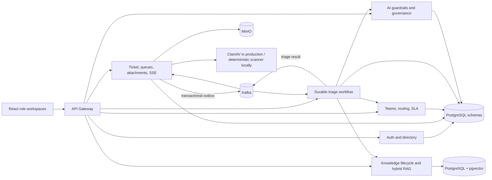
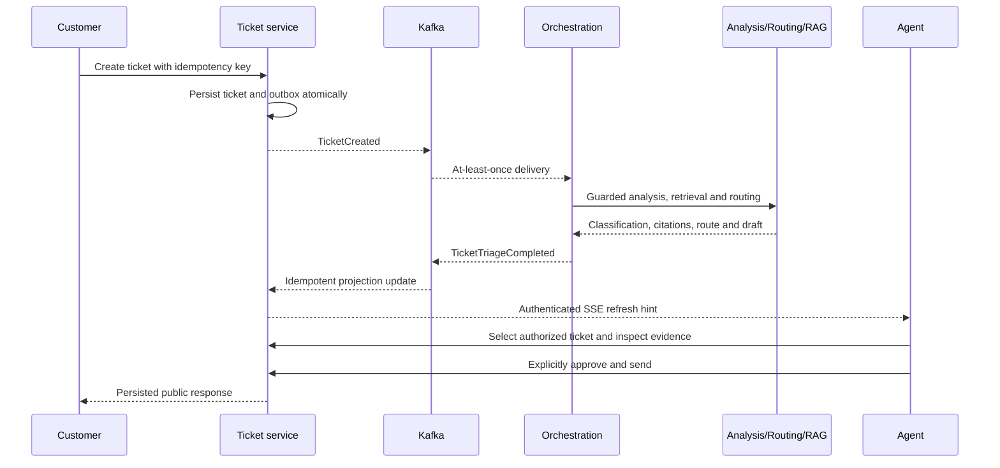

# ResolveIQ Part 1 Architecture and Demonstration Evidence

This document is the evidence companion to `RESOLVEIQ_PART1_IMPLEMENTATION_PLAN.md`. It records what the repository implements, how to prove it, and which visual artifacts the repository owner should capture for a portfolio. It does not treat an unrecorded video or an unexecuted manual check as proof.

## 1. Implemented system



The gateway is the only browser-facing API boundary. Every owning service validates the JWT and tenant again. Displays may compose multiple service APIs, but mutations remain inside the owning service and no service reads another service's schema.

## 2. Principal runtime journeys

### Customer to agent



The model cannot send a customer message. The response is sent only through the ticket command after an authorized human approves it.

### Knowledge publication

```text
DRAFT -> IN_REVIEW -> PUBLISHED -> SUPERSEDED
   |          |             |          |
   |          +-> REJECTED  |          +-> ROLLBACK target
   +-> no retrieval         +-> active, fully indexed version only

Document -> ARCHIVED -> excluded from retrieval without deleting history
```

Publishing creates chunks and embeddings before changing the active version. If indexing fails, the old active version remains available. Retrieval applies tenant, active-version, published-state and optional metadata predicates before lexical/vector ranking.

## 3. Role evidence map

| Persona | Seeded account | Distinct journey and proof |
|---|---|---|
| Customer | `alex.morgan@acme.com` | Create/search/view/reply, safe attachments, ownership-scoped ticket list |
| Agent | `sarah.chen@resolveiq.local` | Personal queue, filters, persisted context/evidence, feedback, human-approved response |
| Team Lead | `marcus.vance@resolveiq.local` | Team and SLA-risk queues, team-scoped ticket access, assignment controls |
| Knowledge Manager | `elena.rostova@resolveiq.local` | Draft/review/publish/reject/new-version/rollback/archive and search |
| Administrator | `admin@resolveiq.local` | Tenant ticket view, routing toggles, users/roles, workflows/outbox and AI governance |
| Auditor | `auditor@resolveiq.local` | Read-only security, ticket, workflow and model evidence; no mutation controls |

All demo users use the fictional local password documented in `UI_END_TO_END_TESTING_GUIDE.md`. Demo credentials are never production defaults.

## 4. Automated evidence

| Gate | What it proves | Command |
|---|---|---|
| Java unit/service tests | State rules, attachments, guardrails, orchestration and retrieval logic | `./mvnw test` on Java 21 |
| Kafka Testcontainers | Duplicate triage delivery changes ticket/suggestion exactly once | `./mvnw -pl :ticket-service -am clean verify` |
| pgvector Testcontainers | Tenant/metadata isolation, active-only retrieval, reindex repair, supersede, rollback and archive | `./mvnw -pl :rag-service -am clean verify` |
| Frontend checks | Lint, component behavior, type safety and production bundle | `npm --prefix frontend run lint && npm --prefix frontend run test && npm --prefix frontend run build` |
| Eight browser journeys | Six seeded roles reach only their intended workspace; customer-to-agent and knowledge lifecycle workflows complete | `npm --prefix frontend run test:e2e` |
| Compose | Complete local topology and hot-reload definitions parse | `docker compose --profile app config --quiet` |
| Kubernetes | Deployments, Services, HPA, PDB, Ingress and NetworkPolicy render | `kubectl kustomize infra/k8s/base` |
| Secrets | No unapproved committed credential patterns | `./scripts/scan-secrets.sh` |

The Java integration tests run automatically during `clean verify`. The browser suite expects a healthy, seeded application. CI starts the full Compose stack, seeds through the lifecycle API, runs Chromium, uploads the Playwright report, and captures service logs on failure.

## 5. API evidence

With the local gateway on `http://localhost:8080`, service-owned OpenAPI documents are available at:

- `/openapi/auth`
- `/openapi/ticket`
- `/openapi/orchestration`
- `/openapi/analysis`
- `/openapi/routing`
- `/openapi/rag`

These routes are intentionally public API descriptions; business endpoints remain authenticated and role/tenant scoped.

Important operational readbacks include:

- pageable `/api/v1/agent/tickets/queue` and `/context`;
- authenticated `/api/v1/agent/tickets/stream` SSE;
- attachment upload/list/download for customer and staff scopes;
- knowledge article/version lifecycle and `/knowledge/admin/reindex-missing`;
- tenant user directory and audited role changes;
- routing teams, agents, rules, activation and SLA policies;
- workflow/ticket outbox summaries and failed workflow replay;
- sanitized AI invocation pages and governance aggregates.

## 6. Local proof run

```bash
# Use conflict-free ports when local PostgreSQL/Kafka/gateway/frontend ports are occupied.
POSTGRES_PORT=55432 KAFKA_PORT=19092 GATEWAY_PORT=18080 FRONTEND_PORT=3300 \
docker compose --profile app up -d --build --wait --wait-timeout 420

RESOLVEIQ_SEED_API_ROOT=http://localhost:18080/api/v1 ./scripts/seed-data.sh

RESOLVEIQ_UI_URL=http://localhost:3300 npm --prefix frontend run test:e2e

docker compose --profile app ps
```

Do not add `--volumes` to a normal stop command; that deletes local portfolio data.

## 7. Screenshot checklist

Capture screenshots only after the corresponding manual test passes:

1. Customer Help Center returning the payment-reconciliation article for the documented natural-language query.
2. Customer-created ticket with its real generated number and attached clean file.
3. Agent selectable queue plus persisted classification, citation, provider/prompt and human-approval boundary.
4. Team Lead team queue with assignment selectors and SLA-risk scope.
5. Knowledge version history showing an active published version and a superseded version eligible for rollback.
6. Administrator routing screen, users/roles screen, outbox health and sanitized AI governance traces.
7. Auditor read-only evidence screen with mutation controls absent.
8. Test output showing Kafka and pgvector Testcontainers passing.
9. Rendered Kubernetes resource summary and the six gateway OpenAPI documents.

Redact browser developer tools, local filesystem paths and any real environment secret before publishing images.

## 8. Interview demonstration script

Target eight to ten minutes:

1. Explain the real support pain: repeat investigation, unsafe ungrounded drafts, weak tenancy and no operational proof.
2. Submit a customer ticket and show asynchronous status movement through Kafka/outbox processing.
3. Open the agent queue, select that ticket, and explain the persisted classification/citations and human approval control.
4. Show a clean attachment round-trip and explain why infected, unsupported or foreign-owned files are rejected.
5. Publish a knowledge draft, search it, create a replacement version, then show rollback and active-only retrieval.
6. Show Admin governance/outbox/routing and the Auditor's read-only variant.
7. Finish with the Testcontainers results, OpenAPI endpoints and Kubernetes base.

State the trade-offs plainly: Compose is the reproducible demo runtime, deterministic AI is for local/CI, real providers and ClamAV are production configuration modes, SSE is a refresh hint rather than the source of truth, and managed PostgreSQL/Kafka/MinIO are external Kubernetes dependencies.

## 9. Owner-run artifacts

The repository supplies the implementation, automated report generation, screenshot list and demo script. The repository owner must still record and review the portfolio video and capture final screenshots in their own environment. Until those files exist, report them as pending presentation artifacts—not missing product functionality and not completed evidence.
